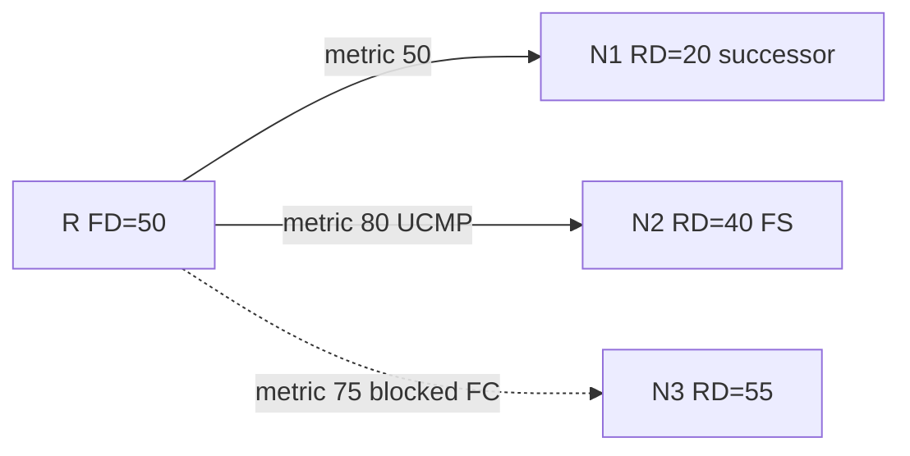

# UCMP worked example

Numeric walkthrough of variance + feasibility for unequal-cost installation.

## Topology metrics

Destination `D`. Local router R learns three paths:

| Neighbor | RD (inner) | Link cost | Local metric (outer) |
|---|---|---|---|
| N1 | 20 | 30 | **50** |
| N2 | 40 | 40 | **80** |
| N3 | 55 | 20 | **75** |

Successor = **N1** (metric 50). **FD = 50**.

### Feasibility check

- N2: RD 40 &lt; FD 50 → **FS** ✓  
- N3: RD 55 &lt; FD 50? **No** → not FS ✗

### Variance 1 (default)

Only successors with metric = 50 install → **N1 only** (ECMP none).

### Variance 2

Window: metric ≤ 2 × 50 = **100**.

- N2 metric 80 ≤ 100 and FS → **install**  
- N3 metric 75 ≤ 100 but **fails FC** → **not installed**

Resulting RIB next hops: **N1 and N2** only.

```text
variance 2
maximum-paths 4
! show ip route D → via N1, via N2
! N3 remains in topology as non-FS (or unused) until Active/FD changes
```



### If we need N3

Must change metrics so RD_N3 &lt; FD (e.g. improve N3’s path toward D) or accept Active when N1/N2 fail. Raising variance to 10 does **not** help N3.

### Share intuition (balanced)

Metrics 50 and 80 → shares roughly proportional to inverse metrics (platform CEF implements discrete share counts). N1 carries more flows than N2.

## Interview framing

Work a table: compute local metrics, pick FD, test RD &lt; FD, apply variance window, conclude installed set. Always show one path that fails FC inside the window.

## Related

- [Variance unequal cost](02_Variance_Unequal_Cost.md)
- [Feasibility condition](../08_DUAL_and_Feasibility/03_Feasibility_Condition.md)
- [UCMP pitfalls](06_UCMP_Pitfalls.md)

---
