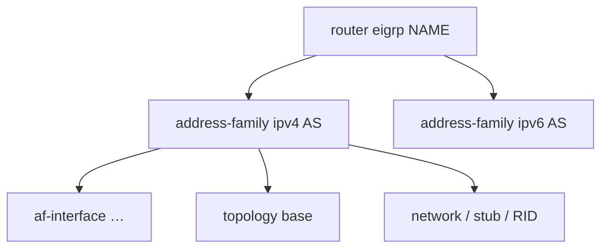

# Named mode structure

**Named mode** configures EIGRP under a process name with explicit **address-families**, per-interface **af-interface** stanzas, and **topology** instances. It is the current Cisco IOS/XE style; classic `router eigrp <AS>` remains widely deployed.

## Hierarchy

```text
router eigrp <NAME>
  address-family ipv4 unicast autonomous-system <AS>
    af-interface default | <interface>
      (hello, auth, summary, split-horizon, bandwidth-percent, …)
    exit-af-interface
    topology base
      (variance, maximum-paths, redistribute, distribute-list, …)
    exit-af-topology
    network …
    eigrp router-id …
    eigrp stub …
  exit-address-family
  address-family ipv6 unicast autonomous-system <AS>
    …
```



## Why named mode

- One process name can host IPv4 and IPv6 AFs (possibly different ASNs per AF—be deliberate).
- Interface knobs scoped under AF (cleaner than mixing classic interface commands alone).
- VRF-aware address-families for multi-VRF PE designs.
- Topology base prepares for multi-topology (where supported).

## Verification entry points

```text
show eigrp protocols
show eigrp address-family ipv4 neighbors
show eigrp address-family ipv4 topology
show eigrp address-family ipv4 interfaces
```

Classic `show ip eigrp …` may still work for IPv4 on many releases; prefer AF-aware forms when using named mode.

## Interview framing

“Named mode = named process + address-family AS + af-interface + topology base. Same DUAL; different CLI packaging.”

## Related

- [Classic AS mode recap](02_Classic_AS_Mode_Recap.md)
- [AF interface configuration](03_AF_Interface_Configuration.md)
- [Minimal working configs](06_Minimal_Working_Configs.md)

---
