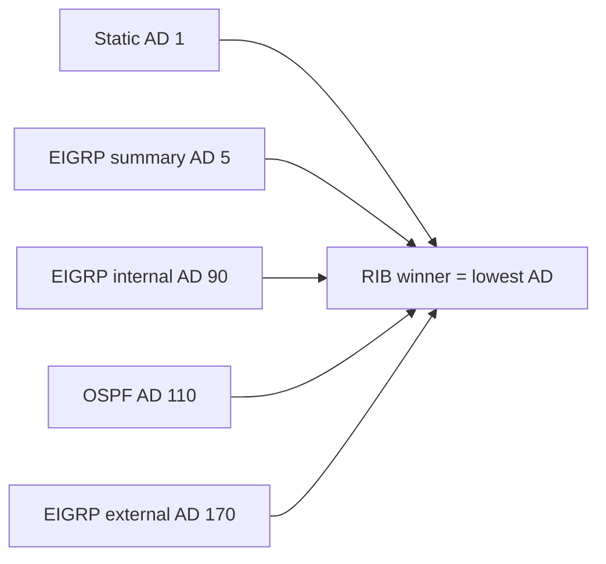

# Administrative distances

**Administrative distance (AD)** is Cisco’s preference rank among sources that install the same prefix into the RIB. Lower AD wins. EIGRP uses three defaults that interviewers and operators must not conflate.

## Cisco defaults (EIGRP)

| Source | Default AD | Notes |
|---|---|---|
| EIGRP summary | **5** | Auto-summary / manual `summary-address` discard-eligible routes |
| EIGRP internal | **90** | Routes learned within the same AS (composite metric) |
| EIGRP external | **170** | Routes redistributed *into* EIGRP (or marked external) |

A redistributed OSPF prefix that enters EIGRP is **external (170)** everywhere in that EIGRP domain—not “almost internal.” That single fact explains many “why did static/OSPF beat EIGRP?” tickets.

## Comparison with common sources

| Source | Typical Cisco AD |
|---|---|
| Connected | 0 |
| Static | 1 |
| eBGP | 20 |
| EIGRP summary | 5 |
| EIGRP internal | 90 |
| OSPF | 110 |
| IS-IS | 115 |
| RIP | 120 |
| EIGRP external | 170 |
| iBGP | 200 |
| Unknown / incomplete | 255 (not installed) |



## Why external is 170

Cisco places EIGRP externals *after* OSPF/IS-IS/RIP so that a casually redistributed foreign prefix does not silently override a native IGP path. Design consequence: at an OSPF↔EIGRP boundary, the OSPF copy of a prefix often wins on the redistribution router itself unless you tune AD or filter.

## Tuning AD (Cisco)

Classic mode:

```text
router eigrp 100
 distance eigrp 90 170
! optional per-prefix:
 distance 90 10.0.0.0 0.255.255.255 ACL-INTERNAL-PREF
```

Named mode (address-family):

```text
router eigrp CORP
 address-family ipv4 unicast autonomous-system 100
  topology base
   distance eigrp 90 170
```

Changing internal AD below OSPF (110) is rarely needed; changing **external** AD below 110 is a common deliberate design when EIGRP should own redistributed prefixes toward an OSPF core—document it.

## Verification

```text
show ip protocols | section eigrp
show ip route 10.10.10.0
! D = internal (90), D EX = external (170), D* = candidate default often summary/default
show ip eigrp topology 10.10.10.0/24
```

Confirm AD in the RIB line (`[AD/metric]`), not only in the topology table.

## Risks

- Assuming “EIGRP always beats OSPF” — false for **D EX**.
- Lowering external AD globally without tags/filters → redistribution loops.
- Forgetting summary AD 5 can blackhole if Null0 is missing (see summarization module).

## Interview framing

“EIGRP internal is 90, external is 170, summary is 5. External loses to OSPF by default; that is intentional, not a bug.”

## Related

- [Redistributing into EIGRP](02_Redistributing_into_EIGRP.md)
- [External AD 170 Surprise](../21_Practical_Cases/06_External_AD_170_Surprise.md)
- [Route in Topology Not in RIB](../20_Troubleshooting/05_Route_in_Topology_Not_in_RIB.md)

---
