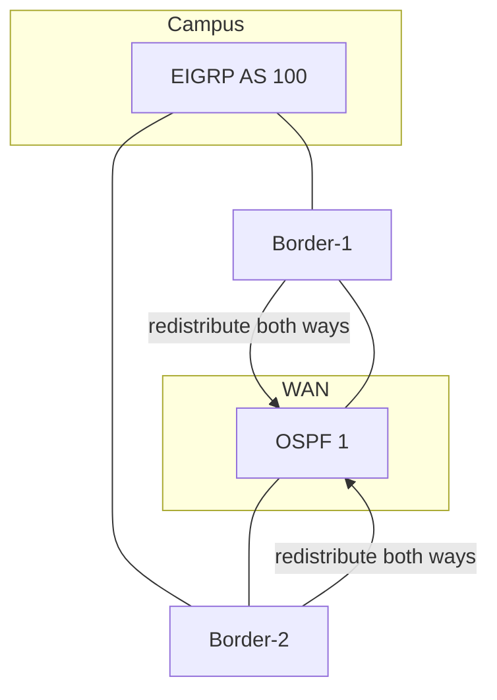

# Mutual redistribution loops

**Mutual redistribution** (EIGRP↔OSPF or EIGRP↔BGP at one or more routers) creates two feedback paths. Without tags and filters, a prefix can oscillate, duplicate, or blackhole under AD competition.

## Topology pattern



Two borders multiply the failure modes: each can re-learn the other’s redistributed copy.

## Failure modes

| Symptom | Mechanism |
|---|---|
| Prefix flaps | Route preferred alternately via IGP A then redistributed IGP B |
| Suboptimal path | External AD 170 loses locally, wins remotely |
| Routing loop | Forwarding follows inconsistent control-plane winners |
| SIA / query storms | Instability floods the EIGRP query domain |

## Hardening pattern (tags + filters)

On **every** redistribution point:

1. When exporting EIGRP → OSPF: `set tag 100`.
2. When exporting OSPF → EIGRP: `set tag 110`, deny `match tag 100`.
3. When exporting EIGRP → OSPF: deny `match tag 110` (and other foreign tags).
4. Prefix-list allow-lists on both maps.
5. Identical policy on Border-1 and Border-2.

```text
! OSPF -> EIGRP
route-map OSPF-TO-EIGRP deny 10
 match tag 100
route-map OSPF-TO-EIGRP permit 20
 match ip address prefix-list FROM-OSPF
 set tag 110
 set metric 100000 100 255 1 1500
!
! EIGRP -> OSPF
route-map EIGRP-TO-OSPF deny 10
 match tag 110
route-map EIGRP-TO-OSPF permit 20
 match ip address prefix-list FROM-EIGRP
 match route-type internal
 set tag 100
 set metric 20
 set metric-type type-2
```

## Prefer single-point or primary/backup

| Design | Pros | Cons |
|---|---|---|
| Single redistributor | Simplest loop math | Single point of failure |
| Dual with identical tags | HA | Must keep configs synchronized |
| Dual with different roles | One injects defaults only | More operational complexity |

## AD is not enough

Raising/lowering AD can prefer one protocol locally but still allow the prefix to re-enter via the other border. Tags stop the control-plane cycle; AD only breaks ties on one box.

## Verification

1. Tag a test prefix on EIGRP-only leaf; confirm present in OSPF with tag 100; confirm **absent** as D EX back in EIGRP.
2. Reverse test from OSPF leaf.
3. Fail Border-1; confirm Border-2 does not create a looped path.
4. `show ip route` / topology stable for 10+ minutes under flap script.

## Risks

- Updating route-maps on one border only.
- Redistributing OSPF externals that are themselves from EIGRP.
- Using `redistribute connected` carelessly on both sides.

## Interview framing

“Mutual redistribution needs deny-own-tag on both directions at every border; AD tuning alone does not stop multi-border loops.”

## Related

- [Route Tags](04_Route_Tags.md)
- [Case: Mutual Redistribution Loop](../21_Practical_Cases/09_Mutual_Redistribution_Loop.md)
- [Administrative Distances](01_Administrative_Distances.md)

---
