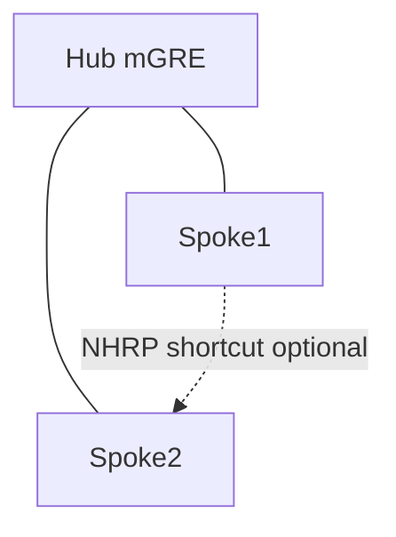

# DMVPN and tunnel notes

EIGRP is a common DMVPN overlay IGP. Treat the tunnel as a WAN NBMA/multipoint fabric: metrics, stubs, split horizon, and NHRP interact.

## High-level roles

| Component | Role |
|---|---|
| mGRE + NHRP | Dynamic spoke tunnel resolution |
| IPsec profile | Encryption (optional but usual) |
| EIGRP | Overlay routing |
| Spoke stub | Bound queries at hub |



## EIGRP over tunnels

```text
interface Tunnel0
 ip address 10.255.0.1 255.255.255.0
 bandwidth 10000
 delay 1000
 ip nhrp map multicast dynamic
 tunnel source GigabitEthernet0/0
 tunnel mode gre multipoint
!
router eigrp 100
 network 10.255.0.0 0.0.0.255
 network 10.0.0.0 0.255.255.255
```

Spoke:

```text
router eigrp 100
 eigrp stub connected summary
 network 10.255.0.0 0.0.0.255
 network 10.10.0.0 0.0.255.255
```

## NHRP interaction (control vs data)

- EIGRP advertises site prefixes via the hub (and possibly spoke-spoke after SH handling).
- NHRP resolves CE-to-CE tunnel endpoints for **data** shortcuts (Phase 2/3).
- A valid EIGRP route with unresolved/wrong next-hop still blackholes until NHRP mapping exists.
- Hub should summarize or send default so spoke RIB stays small.

Phase 3 often uses NHRP redirect + EIGRP at hub with summarization so spokes do not need full mesh of specifics.

## Stub at spokes (mandatory practice)

Without stub, a spoke flap causes hub queries that fan out to **all** other spokes → SIA risk ([DMVPN Spoke Query Problems](../21_Practical_Cases/10_DMVPN_Spoke_Query_Problems.md)).

## Split horizon on hub tunnel

Same as multipoint NBMA: consider `no ip split-horizon eigrp` on hub tunnel **or** rely on summaries/defaults so spokes do not need each other’s specifics.

## Verification

```text
show dmvpn
show ip nhrp
show ip eigrp neighbors
show ip eigrp topology
show ip route
```

## Risks

- Default tunnel bandwidth/delay → absurd metrics.
- Non-stub spokes on large DMVPN.
- Redistributing Internet/BGP into EIGRP at spokes.

## Interview framing

“On DMVPN, run EIGRP with spoke stubs and hub summaries; NHRP fixes data-plane shortcuts while EIGRP provides overlay reachability—set tunnel bandwidth/delay deliberately.”

## Related

- [NBMA and Multipoint](02_NBMA_and_Multipoint.md)
- [Hub-Spoke WAN Checklist](06_Hub_Spoke_WAN_Checklist.md)
- [SIA Storm Without Stub](../21_Practical_Cases/03_SIA_Storm_Without_Stub.md)

---
