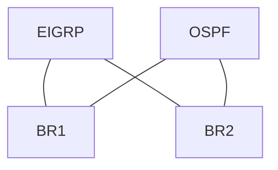

# Case: Mutual redistribution loop

## Topology

```text
EIGRP AS 100 campus ——— BR1 ——— OSPF 1 WAN
                      ——— BR2 ———
Both BR1 and BR2 redistribute EIGRP↔OSPF without tags
Test prefix 10.99.99.0/24 sourced in EIGRP behind campus
```



## Symptom

`10.99.99.0/24` flaps between paths. Traceroute intermittently loops BR1↔BR2. OSPF database shows external from both borders; EIGRP shows D EX bouncing.

## Evidence

```text
show ip route 10.99.99.0
! next-hop alternates BR1/BR2 / OSPF vs EIGRP
show ip eigrp topology 10.99.99.0/24
! External, originating router flips
show ip ospf database external 10.99.99.0
! ASBR BR1 and BR2
show route-map
! no match tag denies
```

## Root cause

BR1 redistributes EIGRP→OSPF; BR2 learns via OSPF and redistributes back→EIGRP as external; BR1 may prefer that path; feedback continues. **No tags** to deny re-import.

## Fix

On both borders:

```text
route-map EIGRP-TO-OSPF deny 10
 match tag 110
route-map EIGRP-TO-OSPF permit 20
 set tag 100
 set metric 20
 set metric-type type-2
!
route-map OSPF-TO-EIGRP deny 10
 match tag 100
route-map OSPF-TO-EIGRP permit 20
 set tag 110
 set metric 100000 100 255 1 1500
```

Verify prefix sourced in EIGRP never returns as OSPF-derived D EX into campus; soak under BR failure.

## Interview takeaway

“Dual-border mutual redistribution without deny-own-tag loops—AD alone will not save you.”

## Related

- [Mutual Redistribution Loops](../15_Redistribution_and_AD/06_Mutual_Redistribution_Loops.md)
- [Route Tags](../15_Redistribution_and_AD/04_Route_Tags.md)

---
