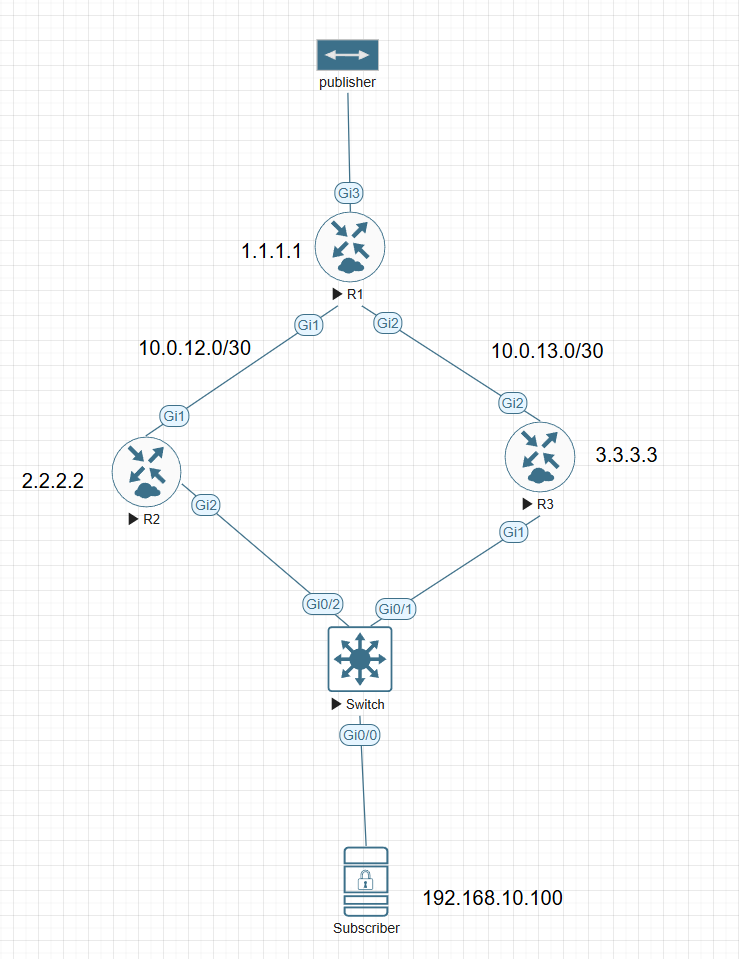
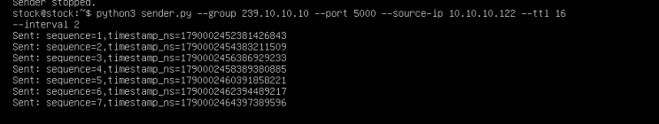
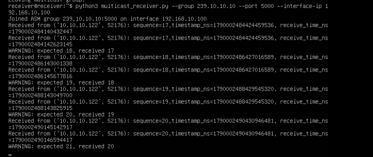

I have written a post before, asking this question: if we use the PIM neighbor filter list to force two LHRs to be the PIM DR simultaneously, would it trigger the PIM Assert mechanism?

Today I have a test for this question. Below is the topology.

## Topology

There is PIM sparse mode for a multicast network, and R1 is the RP. R2 and R3 are both LHRs. The IP of Gi2 on R2, the IP of Gi1 on R3, and the IP of the subscriber are in the same subnet, 192.168.10.0/24.



If we do nothing, the two LHRs elect one DR to send Join messages to the RP. I want to do something different.

I set up a PIM neighbor filter on R2 and R3, forcing them both to be DR on this LAN. Each one then builds an RPT and an SPT toward the multicast source. The question is: since they both forward the multicast stream, will they trigger Assert?

## Before the neighbor filter

PIM neighbors on R2 and R3, before the filter:

```
R2#show ip pim neighbor
PIM Neighbor Table
Mode: B - Bidir Capable, DR - Designated Router, N - Default DR Priority,
      P - Proxy Capable, S - State Refresh Capable, G - GenID Capable,
      L - DR Load-balancing Capable
Neighbor          Interface                Uptime/Expires    Ver   DR
Address                                                            Prio/Mode
10.0.12.1         GigabitEthernet1         00:02:34/00:01:37 v2    1 / S P G
192.168.10.2      GigabitEthernet2         00:00:12/00:01:32 v2    1 / DR S P G
```

```
R3#show ip pim nei
PIM Neighbor Table
Mode: B - Bidir Capable, DR - Designated Router, N - Default DR Priority,
      P - Proxy Capable, S - State Refresh Capable, G - GenID Capable,
      L - DR Load-balancing Capable
Neighbor          Interface                Uptime/Expires    Ver   DR
Address                                                            Prio/Mode
10.0.13.1         GigabitEthernet2         00:00:23/00:01:21 v2    1 / S P G
192.168.10.1      GigabitEthernet1         00:00:03/00:01:41 v2    1 / S P G
```

R2 and R3 are PIM neighbors. R3 (192.168.10.2) is the DR on this LAN, because it has the higher IP address.

## Cut the PIM neighbor relationship

The neighbor filter accepts only the address in the ACL. Everything else is denied, including the other LHR.

```
R2#show run | se access-list
ip access-list standard 10
 10 permit 2.2.2.2

R2#show run int g2
!
interface GigabitEthernet2
 ip address 192.168.10.1 255.255.255.0
 ip pim neighbor-filter 10
 ip pim sparse-mode
 negotiation auto
 no mop enabled
 no mop sysid
end
```

```
R3#show run | se access-list
ip access-list standard 10
 10 permit 3.3.3.3

R3#show run int g1
!
interface GigabitEthernet1
 ip address 192.168.10.2 255.255.255.0
 ip pim neighbor-filter 10
 ip pim sparse-mode
 negotiation auto
 no mop enabled
 no mop sysid
end
```

After the filter, they no longer see each other:

```
R2#show ip pim neighbor
PIM Neighbor Table
Mode: B - Bidir Capable, DR - Designated Router, N - Default DR Priority,
      P - Proxy Capable, S - State Refresh Capable, G - GenID Capable,
      L - DR Load-balancing Capable
Neighbor          Interface                Uptime/Expires    Ver   DR
Address                                                            Prio/Mode
10.0.12.1         GigabitEthernet1         00:04:00/00:01:41 v2    1 / S P G
```

```
R3#show ip pim neighbor
PIM Neighbor Table
Mode: B - Bidir Capable, DR - Designated Router, N - Default DR Priority,
      P - Proxy Capable, S - State Refresh Capable, G - GenID Capable,
      L - DR Load-balancing Capable
Neighbor          Interface                Uptime/Expires    Ver   DR
Address                                                            Prio/Mode
10.0.13.1         GigabitEthernet2         00:02:13/00:01:29 v2    1 / S P G
```

R2 and R3 are not neighbors anymore. Each router is alone on the LAN, so each one elects itself DR.

## Start the publisher and the subscriber

The sender is 10.10.10.122, group 239.10.10.10, UDP port 5000.



The receiver joined the same group on 192.168.10.100. Every sequence arrives twice, and the script warns that the sequence it expected was already received.



The receiver got double multicast packets. They did not trigger the PIM Assert mechanism.

## mroute on R2 and R3

R2 and R3 each created the RPT and the SPT on their own. Neither outgoing interface is marked as an Assert winner.

```
R2#show ip mroute
...
(*, 239.10.10.10), 00:11:46/stopped, RP 1.1.1.1, flags: SJC
  Incoming interface: GigabitEthernet1, RPF nbr 10.0.12.1
  Outgoing interface list:
    GigabitEthernet2, Forward/Sparse, 00:00:14/00:02:52

(10.10.10.122, 239.10.10.10), 00:06:48/00:00:11, flags: JT
  Incoming interface: GigabitEthernet1, RPF nbr 10.0.12.1
  Outgoing interface list:
    GigabitEthernet2, Forward/Sparse, 00:00:14/00:02:52
...
```

```
R3#show ip mroute
...
(*, 239.10.10.10), 00:12:07/stopped, RP 1.1.1.1, flags: SJC
  Incoming interface: GigabitEthernet2, RPF nbr 10.0.13.1
  Outgoing interface list:
    GigabitEthernet1, Forward/Sparse, 00:00:35/00:02:31

(10.10.10.122, 239.10.10.10), 00:07:09/00:02:49, flags: JT
  Incoming interface: GigabitEthernet2, RPF nbr 10.0.13.1
  Outgoing interface list:
    GigabitEthernet1, Forward/Sparse, 00:00:35/00:02:31
...
```

## Why Assert never fired

Cisco's document says:

> To inhibit unwanted neighbors use the ip pim neighbor-filter command illustrated in Figure 7. This command filters from all non-allowed neighbors PIM packets, which includes Hellos, Join/Prune packets, and BSR packets.

Reference: [Secure IP Multicast Deployments - Cisco](https://www.cisco.com/c/en/us/support/docs/ip/ip-multicast/218004-secure-ip-multicast-deployments.html)

`ip pim neighbor-filter` does not only drop Hellos. It filters PIM packets from every neighbor the ACL does not permit. PIM Assert is message type 5. R2 never accepts Assert from R3, and R3 never accepts Assert from R2, so neither router can lose the Assert election. Both keep forwarding, and the subscriber receives every packet twice.

## Is the PIM DR also the IGMP querier?

Back to the other question from the previous post: when two or more LHRs elect the PIM DR, is the winner also the IGMP querier?

```
R2#show ip igmp interface g2
GigabitEthernet2 is up, line protocol is up
  Internet address is 192.168.10.1/24
  IGMP is enabled on interface
  Current IGMP host version is 2
  Current IGMP router version is 2
  IGMP query interval is 60 seconds
  IGMP configured query interval is 60 seconds
  IGMP querier timeout is 120 seconds
  IGMP configured querier timeout is 120 seconds
  IGMP max query response time is 10 seconds
  Last member query count is 2
  Last member query response interval is 1000 ms
  Inbound IGMP access group is not set
  IGMP activity: 7 joins, 6 leaves
  Multicast routing is enabled on interface
  Multicast TTL threshold is 0
  Multicast designated router (DR) is 192.168.10.1 (this system)
  IGMP querying router is 192.168.10.1 (this system)
  No multicast groups joined by this system
```

```
R3#show ip igmp interface g1
GigabitEthernet1 is up, line protocol is up
  Internet address is 192.168.10.2/24
  IGMP is enabled on interface
  Current IGMP host version is 2
  Current IGMP router version is 2
  IGMP query interval is 60 seconds
  IGMP configured query interval is 60 seconds
  IGMP querier timeout is 120 seconds
  IGMP configured querier timeout is 120 seconds
  IGMP max query response time is 10 seconds
  Last member query count is 2
  Last member query response interval is 1000 ms
  Inbound IGMP access group is not set
  IGMP activity: 8 joins, 7 leaves
  Multicast routing is enabled on interface
  Multicast TTL threshold is 0
  Multicast designated router (DR) is 192.168.10.2 (this system)
  IGMP querying router is 192.168.10.1
  No multicast groups joined by this system
```

R2 and R3 are both DRs, but R2 is the only IGMP querier. IGMPv2 elects the querier by the lowest IP address on the subnet, which is 192.168.10.1. The PIM DR election and the IGMP querier election are independent. Filtering PIM Hellos does not change who sends IGMP queries.

Next episode preview: the hidden trigger-free mechanism of PIM Assert.
