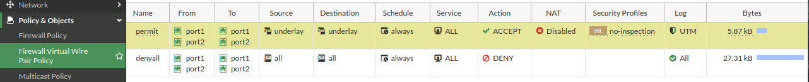
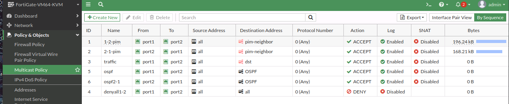
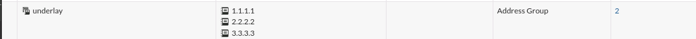
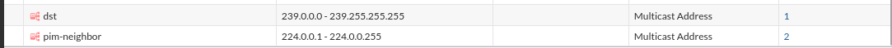
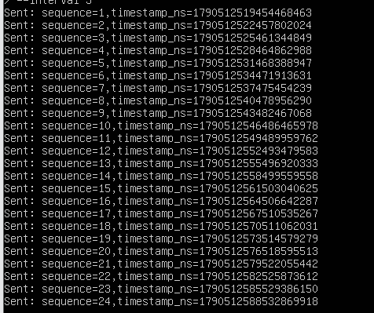
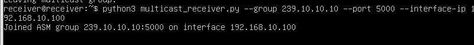
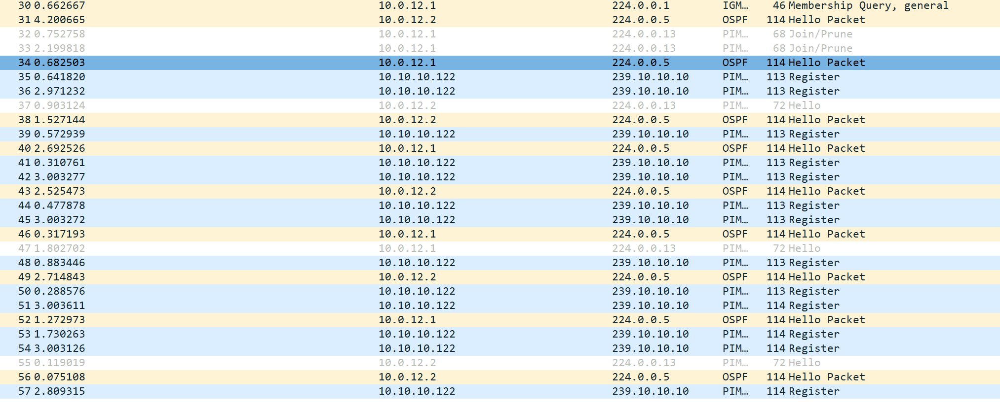

Since Alex was transferred to the trading network team, he has done very well. He learned new things fast and really enjoys his new position (see the previous article: [How to subscribe to a multicast group across a unicast network](/post/how-to-subscribe-multicast-across-a-unicast-network)). One day he was assigned a troubleshooting ticket. His colleague John told him that they had built a new internal trading simulation network, but the trading team said subscribers were not receiving any trading stream. They had already checked the source and the receiver, and both looked normal. So they raised a ticket.

John shared the topology with Alex.

## Topology

The source is the trading feed, `10.10.10.122`. The receiver (Net) is `192.168.10.100`. The group they want to join is `239.10.10.10`.


The FortiGate is in virtual wire mode. Port1 and port2 are in the same virtual wire pair. FHR, RP, and LHR run OSPF for the underlay.

- FHR loopback0: `1.1.1.1`
- RP loopback0: `2.2.2.2`
- LHR loopback0: `3.3.3.3`
- FHR Gi1 — RP Gi2: `10.0.12.0/30`
- RP Gi1 — LHR Gi1: `10.0.23.0/30`

## Policies on the FortiGate

Virtual wire pair policy:



Multicast policy:



The address objects those policies use:





## Unicast looks fine

Alex tested ping from FHR to RP and LHR. The echoes came back.

```
FHR#ping 3.3.3.3 source 1.1.1.1
Type escape sequence to abort.
Sending 5, 100-byte ICMP Echos to 3.3.3.3, timeout is 2 seconds:
Packet sent with a source address of 1.1.1.1
!!!!!
Success rate is 100 percent (5/5), round-trip min/avg/max = 2/2/3 ms

FHR#ping 2.2.2.2 source 1.1.1.1
Type escape sequence to abort.
Sending 5, 100-byte ICMP Echos to 2.2.2.2, timeout is 2 seconds:
Packet sent with a source address of 1.1.1.1
!!!!!
Success rate is 100 percent (5/5), round-trip min/avg/max = 1/1/2 ms
```

## The source is sending

The trading feed is publishing to `239.10.10.10`.



## The receiver joined, and then nothing

The receiver joined the group on `192.168.10.100` and then sat there. No data.



## mroute on the three routers

**LHR** has a shared tree for `239.10.10.10` and no source tree.

```
LHR#show ip mroute
...
(*, 239.255.255.250), 03:19:07/00:02:31, RP 2.2.2.2, flags: SJC
  Incoming interface: GigabitEthernet1, RPF nbr 10.0.23.1
  Outgoing interface list:
    GigabitEthernet4, Forward/Sparse, 00:00:28/00:02:31

(*, 239.10.10.10), 00:00:06/00:02:56, RP 2.2.2.2, flags: SJC
  Incoming interface: GigabitEthernet1, RPF nbr 10.0.23.1
  Outgoing interface list:
    GigabitEthernet4, Forward/Sparse, 00:00:06/00:02:56

(*, 224.0.1.40), 03:19:35/00:02:31, RP 2.2.2.2, flags: SJCL
  Incoming interface: GigabitEthernet1, RPF nbr 10.0.23.1
  Outgoing interface list:
    Loopback0, Forward/Sparse, 03:19:35/00:02:31
```

**RP** also has only the shared tree. The incoming interface is Null. There is no `(S,G)`.

```
RP#show ip mroute
...
(*, 239.255.255.250), 03:27:39/00:02:50, RP 2.2.2.2, flags: S
  Incoming interface: Null, RPF nbr 0.0.0.0
  Outgoing interface list:
    GigabitEthernet1, Forward/Sparse, 00:00:50/00:02:50
    GigabitEthernet2, Forward/Sparse, 03:27:39/00:02:35

(*, 239.10.10.10), 00:00:27/00:03:02, RP 2.2.2.2, flags: S
  Incoming interface: Null, RPF nbr 0.0.0.0
  Outgoing interface list:
    GigabitEthernet1, Forward/Sparse, 00:00:27/00:03:02

(*, 224.0.1.40), 03:31:01/00:03:18, RP 2.2.2.2, flags: SJCL
  Incoming interface: Null, RPF nbr 0.0.0.0
  Outgoing interface list:
    GigabitEthernet1, Forward/Sparse, 03:19:52/00:03:18
    GigabitEthernet2, Forward/Sparse, 03:27:35/00:02:35
    Loopback0, Forward/Sparse, 03:31:01/00:02:22
```

**FHR** created the source tree, and it is stuck registering. The outgoing interface list is empty.

```
FHR#show ip mroute
...
(*, 239.255.255.250), 03:31:19/00:02:43, RP 2.2.2.2, flags: SJC
  Incoming interface: GigabitEthernet1, RPF nbr 10.0.12.2
  Outgoing interface list:
    GigabitEthernet4, Forward/Sparse, 03:31:19/00:02:43

(*, 239.10.10.10), 00:01:34/stopped, RP 2.2.2.2, flags: SPF
  Incoming interface: GigabitEthernet1, RPF nbr 10.0.12.2
  Outgoing interface list: Null

(10.10.10.122, 239.10.10.10), 00:01:34/00:01:25, flags: PFT
  Incoming interface: GigabitEthernet4, RPF nbr 0.0.0.0, Registering
  Outgoing interface list: Null

(*, 224.0.1.40), 03:32:14/00:02:58, RP 2.2.2.2, flags: SJCL
  Incoming interface: GigabitEthernet1, RPF nbr 10.0.12.2
  Outgoing interface list:
    Loopback0, Forward/Sparse, 03:32:14/00:02:58
```

## Capture on FHR Gi1

Alex captured packets on Gi1 of the FHR, the interface that faces the firewall. PIM Register messages for `239.10.10.10` keep leaving, and nothing comes back to stop them.



Alex thought for a while, then told John he knew the root cause.

Do you know what the root cause is?
