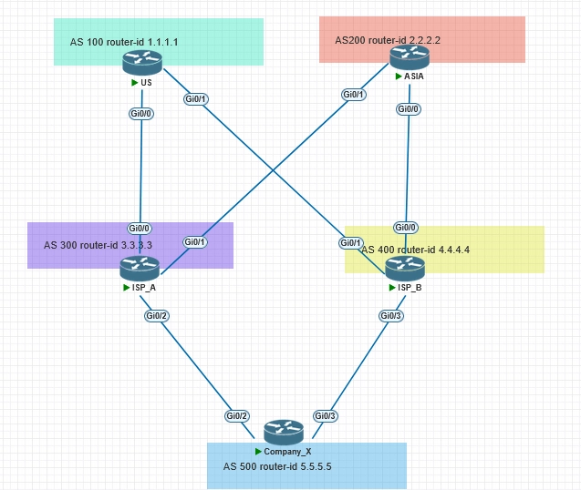

## Introduction

In our network engineer group, the group owner, Parry Wang, gave us a scenario question:

> Given two tier1 ISP vendors, which provide internet service to Company X. ISP A is in charge of traffic to the EU, the US, and Africa. ISP B is in charge of traffic to APAC. The ideal scenario is to have traffic both go and return via the same ISP. That is, traffic destined for the UK (European IP) should exit and return through ISP A, while traffic destined for Australia (Asia-Pacific IP) should exit and return through ISP B.

Inbound traffic is currently managed using BGP community settings. Traffic from the EU, the US, and Africa routes through ISP A's network to reach Company X, while traffic from the APAC routes through ISP B's network to Company X.

There is an issue with outbound traffic management. The X lacks methods to control outbound traffic effectively. According to the path selection algorithm, route selection is determined by the AS path length. If multiple route prefixes have the same AS path length, the selection defaults to the 11th path selection rule, which prioritizes the route with the lowest router ID. But it is not stable.

Imagine this scenario: Multiple peers connect to Microsoft. The AS path length from ISP A is identical to that of ISP B. For example, Microsoft's ASN is 8075, ISP A's ASN is 100, and ISP B's ASN is 200. When checking the BGP table, there are two prefixes with the same path length: one is 100 8075, and the other is 200 8075.

Using Local Preference to influence traffic, which impacts the AS PATH, is not scalable given the presence of nearly 1 million prefixes on the internet. So, what methods can be used to avoid simply using the lowest router ID as a tiebreaker when AS_PATHs are equal, in order to dynamically ensure that all outbound traffic destined for Europe, America, and Africa consistently goes through ISP A, while all outbound traffic to the Asia-Pacific region consistently goes through ISP B?

Very complicated situation, huh? Parry Wang shared the MED solution to deal with it. We can use MED to influence outbound. Someone will say: Hold on a moment, isn't MED used to influence inbound traffic? Yes, but let's not be so rigid. We can also use MED to influence it. Let's go!

## Topology



## Configuration

### US

```
int g0/0
ip add 10.0.13.1 255.255.255.252
no shut
int g0/1
ip add 10.0.14.1 255.255.255.252
no shut

int loo0
ip add 1.1.1.1 255.255.255.255
no shut

int loo1
ip add 10.10.10.10 255.255.255.255
no shut
int loo2
ip add 11.11.11.11 255.255.255.255
no shut
int loo3
ip add 111.111.111.111 255.255.255.255
no shut

router bgp 100
bgp router-id 1.1.1.1
neighbor 10.0.13.2 remote-as 300
neighbor 10.0.14.2 remote-as 400

address-family ipv4
neighbor 10.0.13.2 activate
neighbor 10.0.14.2 activate
network 1.1.1.1 mask 255.255.255.255
network 10.10.10.10 mask 255.255.255.255
network 11.11.11.11 mask 255.255.255.255
network 111.111.111.111 mask 255.255.255.255
```

### ASIA

```
int g0/0
ip add 10.0.24.1 255.255.255.252
no shut
int g0/1
ip add 10.0.23.1 255.255.255.252
no shut

int loo0
ip add 2.2.2.2 255.255.255.255
no shut

int loo1
ip add 20.20.20.20 255.255.255.255
no shut
int loo2
ip add 22.22.22.22 255.255.255.255
no shut
int loo3
ip add 222.222.222.222 255.255.255.255

router bgp 200
bgp router-id 2.2.2.2
neighbor 10.0.23.2 remote-as 300
neighbor 10.0.24.2 remote-as 400

address-family ipv4
neighbor 10.0.23.2 activate
neighbor 10.0.24.2 activate
network 2.2.2.2 mask 255.255.255.255
network 20.20.20.20 mask 255.255.255.255
network 22.22.22.22 mask 255.255.255.255
network 222.222.222.222 mask 255.255.255.255
```

### ISP A

```
int g0/0
ip add 10.0.13.2 255.255.255.252
no shut
int g0/1
ip add 10.0.23.2 255.255.255.252
no shut
int g0/2
ip add 10.0.35.1 255.255.255.252
no shut

int loo0
ip add 3.3.3.3 255.255.255.255

ip bgp-community new-format

route-map fromUS permit 10
set community 100:300
route-map fromASIA permit 10
set community 200:300

router bgp 300
bgp router-id 3.3.3.3
neighbor 10.0.13.1 remote-as 100
neighbor 10.0.23.1 remote-as 200
neighbor 10.0.35.2 remote-as 500

 address-family ipv4
  neighbor 10.0.13.1 activate
  neighbor 10.0.13.1 route-map fromUS in
  neighbor 10.0.23.1 activate
  neighbor 10.0.23.1 route-map fromASIA in
  neighbor 10.0.35.2 activate
  neighbor 10.0.35.2 send-community
 exit-address-family
```

### ISP B

```
int g0/0
ip add 10.0.24.2 255.255.255.252
no shut

int g0/1
ip add 10.0.14.2 255.255.255.252
no shut

int g0/3
ip add 10.0.45.1 255.255.255.252
no shut

int loo0
ip add 4.4.4.4 255.255.255.255
no shut

route-map fromASIA permit 10
 set community 200:400
!
route-map fromUS permit 10
 set community 100:400

ip bgp-community new-format

router bgp 400
bgp router-id 4.4.4.4

neighbor 10.0.24.1 remote-as 200
neighbor 10.0.14.1 remote-as 100
neighbor 10.0.45.2 remote-as 500

 address-family ipv4
  neighbor 10.0.14.1 activate
  neighbor 10.0.14.1 route-map fromUS in
  neighbor 10.0.24.1 activate
  neighbor 10.0.24.1 route-map fromASIA in
  neighbor 10.0.45.2 activate
  neighbor 10.0.45.2 send-community
 exit-address-family
```

### Company X

```
int g0/2
ip add 10.0.35.2 255.255.255.252
no shut
int g0/3
ip add 10.0.45.2 255.255.255.252
no shut

int loo0
ip add 5.5.5.5 255.255.255.255
no shut

ip bgp-community new-format

router bgp 500
bgp router-id 1.1.1.1

neighbor 10.0.35.1 remote-as 300
neighbor 10.0.45.1 remote-as 400

address-family ipv4
neighbor 10.0.35.1 activate
neighbor 10.0.45.1 activate
```

## Verification

Let's verify route entries on X:

```
X#show ip bgp
BGP table version is 9, local router ID is 1.1.1.1
Status codes: s suppressed, d damped, h history, * valid, > best, i - internal,
              r RIB-failure, S Stale, m multipath, b backup-path, f RT-Filter,
              x best-external, a additional-path, c RIB-compressed,
Origin codes: i - IGP, e - EGP, ? - incomplete
RPKI validation codes: V valid, I invalid, N Not found

     Network          Next Hop            Metric LocPrf Weight Path
 *   1.1.1.1/32       10.0.45.1                              0 400 100 i
 *>                   10.0.35.1                              0 300 100 i
 *   2.2.2.2/32       10.0.45.1                              0 400 200 i
 *>                   10.0.35.1                              0 300 200 i
...
```

We saw routes from the US and ASIA are selected to ISP_A (3.3.3.3) by the lowest router ID.

```
X#show ip bgp 1.1.1.1
...
      Community: 100:400
...
      Community: 100:300
```

## Solution 1 — MED

We also saw that the X received the community attributes from ISPA and ISPB. So let's use MED to influence path selection. We want the traffic toward the US to go to ISPA and the traffic toward ASIA to go to ISPB. Here we go!

```
ip community-list standard fromA_US permit 100:300
ip community-list standard fromA_ASIA permit 200:300
ip community-list standard fromB_US permit 100:400
ip community-list standard fromB_ASIA permit 200:400

route-map fromB permit 10
 match community fromB_ASIA
 set metric 10
!
route-map fromB permit 20
 match community fromB_US
 set metric 20
!
route-map fromA permit 10
 match community fromA_US
 set metric 10
!
route-map fromA permit 20
 match community fromA_ASIA
 set metric 20

router bgp 500

address-family ipv4
neighbor 10.0.35.1 route-map fromA in
neighbor 10.0.45.1 route-map fromB in

clear ip bgp * soft in
```

OK, let's show the BGP routing table.

```bash
X#show ip bgp
...
 *   1.1.1.1/32       10.0.45.1               20             0 400 100 i
 *>                   10.0.35.1               10             0 300 100 i
 *   2.2.2.2/32       10.0.45.1               10             0 400 200 i
 *>                   10.0.35.1               20             0 300 200 i
...
```

It didn't work. Why? By default, BGP only compares MED among multiple paths from the same neighbor AS. If your neighbors A and B are from different ASes, you need to configure the `bgp always-compare-med` command under the BGP process to force the router to compare MED even among paths from different ASes.

```bash
router bgp 500
bgp always-compare-med
```

Let's check the routing table again!

```
X#show ip bgp
...
 *>  1.1.1.1/32       10.0.35.1               10             0 300 100 i
 *>  2.2.2.2/32       10.0.45.1               10             0 400 200 i
...
```

See? We made it! Well done!

## Solution 2 — Origin type

Since the MED works fine, we can also choose the origin type to influence traffic. The priority of the origin type is behind the AS path comparison. It prefers the path with the lowest origin type. IGP is lower than Exterior Gateway Protocol (EGP), and EGP is lower than INCOMPLETE.

```
route-map fromB permit 10
 match community fromB_ASIA
 set origin igp
!
route-map fromB permit 20
 match community fromB_US
 set origin incomplete
!
route-map fromA permit 10
 match community fromA_US
 set origin igp
!
route-map fromA permit 20
 match community fromA_ASIA
 set origin incomplete

router bgp 500
 bgp router-id 1.1.1.1
 bgp log-neighbor-changes
 neighbor 10.0.35.1 remote-as 300
 neighbor 10.0.45.1 remote-as 400

 address-family ipv4
  neighbor 10.0.35.1 activate
  neighbor 10.0.35.1 route-map fromA in
  neighbor 10.0.45.1 activate
  neighbor 10.0.45.1 route-map fromB in
 exit-address-family
```

OK! Let's check if it works or not.

```
X#show ip bgp
...
 *>  1.1.1.1/32       10.0.35.1                              0 300 100 i
 *>  2.2.2.2/32       10.0.45.1                              0 400 200 i
...
```

Beautiful! Beautiful! We made it!

## Conclusion

In this scenario, MED can be a useful method to achieve the desired outcome. Instead of being limited to inbound traffic (specifically within the same ASN), it can also be applied to outbound traffic effectively. Although some engineers might overlook it due to its origin type, it proves to be a reliable and efficient solution.
