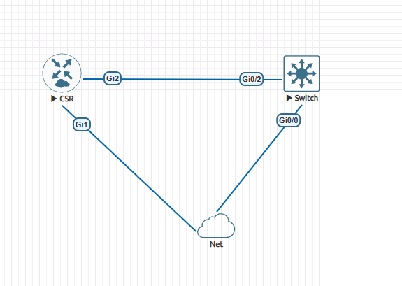
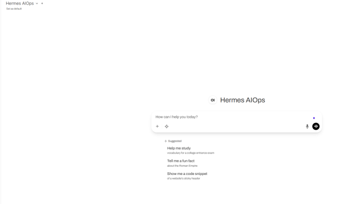
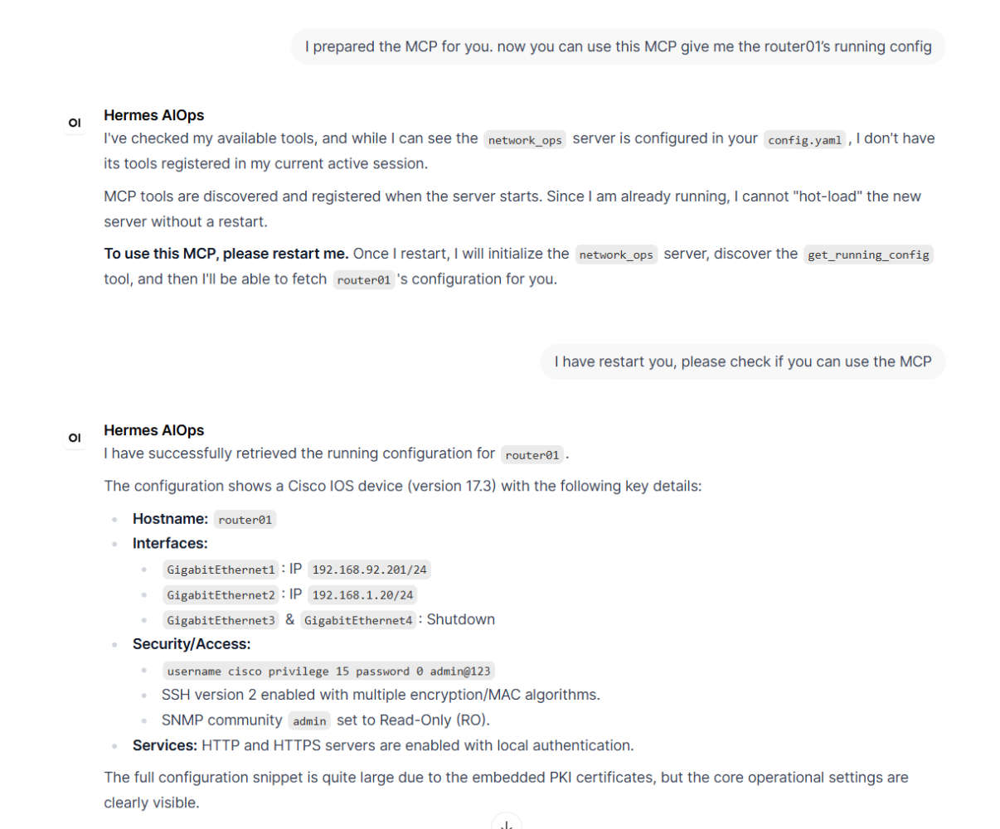
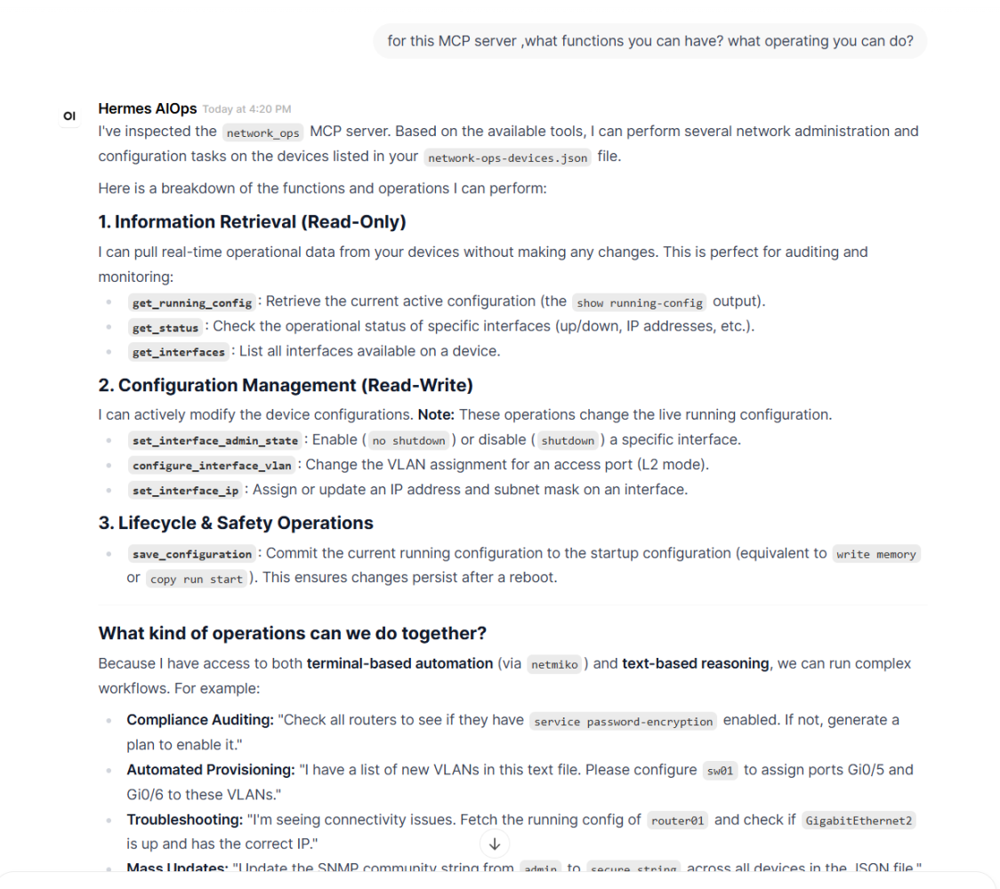
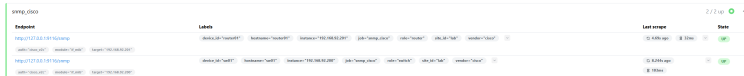
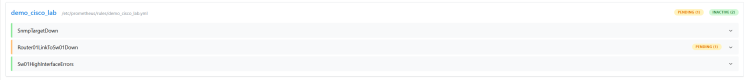
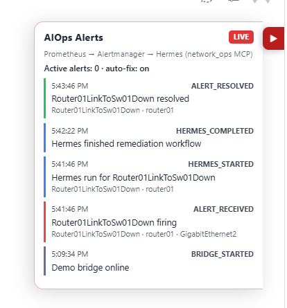
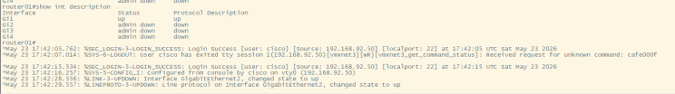

I said that I will vibe coding a demo for the AIops cycle. Today I use Cursor to complete this demo. It works fine. This demo verifies several of my ideas:

1. Agent + Local model (even the 26b small model) can provide an amazing experience for AIops. For companies worried about data security, this approach is the best option.
2. An agent framework with a well-designed architecture is very crucial. In this experiment, Hermes + Gemma:26b demonstrated impressive performance.
3. In the future, many B2B software companies will go out of business. This is because many needs can be customized and adapted to their own company products through vibe coding.

## Stack for this experiment

**AI agent framework:**

- Hermes agent

**AI model:**

- Gemma:26b (local model)

**Monitoring platform:**

- Prometheus

**Simulation platform:**

- EVE-NG

## Topology

I use EVE-NG to run a Cisco router and switch. And I use Ubuntu for Hermes. My physical PC has a GPU 3090, so I use Ollama to run `gemma:26b`.



## Workflow architecture

```
router01 / sw01  --SNMP v2c-->  snmp_exporter :9116
        ^                              |
        |                              v
     SSH (MCP)                   Prometheus :9090
        ^                              |
        |                         alert rules
        |                              v
   network-ops-mcp              Alertmanager :9093
        ^                              |
        |                         webhook POST
   Hermes :8642  <------------  demo-bridge :5001
        ^
        |
   Open WebUI :8080  (sidebar AIOps panel polls :5001/demo/events)
```



### Key metrics and alerts

| Metric / alert | Purpose |
|----------------|---------|
| `up{job="snmp_cisco"}` | SNMP scrape health per device |
| `ifOperStatus` | Interface oper state (1=up, 2=down) |
| `ifAdminStatus` | Admin state (1=up, 2=down) |
| `ifInErrors` / `ifOutErrors` | Error counters (sw01 warning rule) |
| **SnmpTargetDown** | Device unreachable via SNMP |
| **Router01LinkToSw01Down** | Demo trigger on Gi2 |
| **Sw01HighInterfaceErrors** | Secondary signal on switch |

## Deployment and MCP integration

When I deployed Hermes, it worked fine.



And then, I created an MCP for NetOps, which works fine with Hermes.



Hermes can provide you with information about its available tools.



After that, I use Prometheus to monitor two devices.



If we were in the last year (2025), we would have to use LangChain and LangGraph to build workflows to do AIops. But today, we have a completed AI agent framework and skills.

## Alert-driven remediation

So when I closed Gi2 on router01, it triggered an alert in Prometheus. The AI agent took over this alert to troubleshoot and fix this issue using skills.





See? Great job! This is the smallest demo for the AIops loop. You can use the same way to define many skills or workflows to match your requirements in your company. We can use an AI agent as the L1 engineer to check something, try to fix something, and finally provide a report.

The project is available at [AIautomation](https://github.com/beautiful1112/AIautomation).
