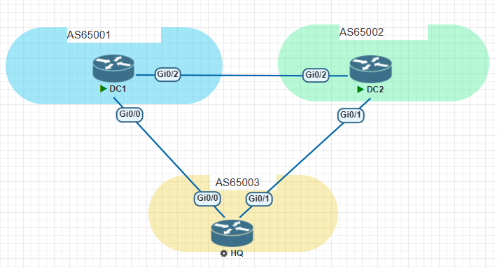

# Introduction

I’ve watched a video on YouTube called [“Some boring network engineering interview questions and how to replace them with smarter”](https://www.youtube.com/watch?v=g35UumfZ-H4&t=1s). This speaker said that we should use scenario questions and open-ended questions to replace boring questions. Many tech interviewers tend to ask questions that rely on rote memorization. While some individuals can flawlessly recall theories, they often struggle when confronted with real-world scenarios.

So I’ve been asked this scenario question to test BGP knowledge. Let's go!

# The scenario question

## Topology




## Configuration

### DC1

```routeros
int g0/0
ip add 10.0.13.1 255.255.255.252
no shut

int g0/2
ip add 10.0.12.1 255.255.255.252
no shut

int loo0
ip add 1.1.1.1 255.255.255.255
no shut

int loo1
ip add 11.11.11.11 255.255.255.255
no shut

int loo2
ip add 111.111.111.111 255.255.255.255
no shut

router bgp 65001
bgp router-id 1.1.1.1

neighbor 10.0.13.2 remote-as 65003
neighbor 10.0.12.2 remote-as 65002
address-family ipv4
neighbor 10.0.13.2 activate
neighbor 10.0.12.2 activate
network 1.1.1.1 mask 255.255.255.255
network 11.11.11.11 mask 255.255.255.255
network 111.111.111.111 mask 255.255.255.255

```

### DC2

```routeros
int g0/1
ip add 10.0.23.1 255.255.255.252
no shut

int g0/2
ip add 10.0.12.2 255.255.255.252
no shut

int loo0
ip add 2.2.2.2 255.255.255.255
no shut

int loo1
ip add 22.22.22.22 255.255.255.255
no shut

int loo2
ip add 122.122.122.122 255.255.255.255
no shut

router bgp 65002
bgp router-id 2.2.2.2

neighbor 10.0.23.2 remote-as 65003
neighbor 10.0.12.1 remote-as 65001

address-family ipv4
neighbor 10.0.23.2 activate
neighbor 10.0.12.1 activate
network 2.2.2.2 mask 255.255.255.255
network 22.22.22.22 mask 255.255.255.255
network 122.122.122.122 mask 255.255.255.255


```

### HQ

```routeros
int g0/0
ip add 10.0.13.2 255.255.255.252
no shut

int g0/1
ip add 10.0.23.2 255.255.255.252
no shut

int loo0
ip add 3.3.3.3 255.255.255.255
no shut

int loo1
ip add 33.33.33.33 255.255.255.255
no shut

int loo2
ip add 133.133.133.133 255.255.255.255
no shut

router bgp 65003
bgp router-id 3.3.3.3
neighbor 10.0.13.1 remote-as 65001
neighbor 10.0.23.1 remote-as 65002

address-family ipv4
neighbor 10.0.13.1 activate
neighbor 10.0.23.1 activate
network 3.3.3.3 mask 255.255.255.255
network 33.33.33.33 mask 255.255.255.255
network 133.133.133.133 mask 255.255.255.255

```

## Question:

How can we redirect all traffic between HQ and DC1 through the link to DC2 without shutting down the interfaces between HQ and DC1 or terminating the BGP session? You can only configure the HQ route. Please provide multiple solutions if possible.

# What are the questions testing?

## BGP attributes and path selection algorithm

This question is a good test of candidates 'theoretical grasp of BGP and whether they have out-of-the-box thinking. If you are good at the path selection algorithm, you can make many methods to achieve the goal.

# Solutions

Before we start, we need to clarify a few conditions first. On the BGP scenario, we need to think about the bidirectional traffic. This means that we should use those attributes to control inbound traffic and outbound traffic. Interestingly, the direction of the data plane and the control plane is opposite. We send routes to each other and control inbound traffic, which is how others access us. We receive routes from each other and control outbound traffic, which is how we access each other. So we need to consider inbound and outbound separately.

## For inbound traffic

### 1\. AS path prepending

We can use the fourth path selection: Prefer the path with the shortest AS\_PATH. So when we add the AS-path of local routes to DC1, DC1 prefers the routes from DC2, not HQ.

Let’s see the current DC1 routing-table:

```routeros
DC1#show ip bgp 
BGP table version is 16, local router ID is 1.1.1.1
Status codes: s suppressed, d damped, h history, * valid, > best, i - internal, 
              r RIB-failure, S Stale, m multipath, b backup-path, f RT-Filter, 
              x best-external, a additional-path, c RIB-compressed, 
Origin codes: i - IGP, e - EGP, ? - incomplete
RPKI validation codes: V valid, I invalid, N Not found

     Network          Next Hop            Metric LocPrf Weight Path
 *>  1.1.1.1/32       0.0.0.0                  0         32768 i
 *   2.2.2.2/32       10.0.13.2                              0 65003 65002 i
 *>                   10.0.12.2                0             0 65002 i
 *   *3.3.3.3/32**       10.0.12.2                              0 65002 65003 i
 *>                   *10.0.13.2                0             0 65003 i**
 *>  11.11.11.11/32   0.0.0.0                  0         32768 i
 *   22.22.22.22/32   10.0.13.2                              0 65003 65002 i
 *>                   10.0.12.2                0             0 65002 i
 *   *33.33.33.33/32**   10.0.12.2                              0 65002 65003 i
 *>                   *10.0.13.2                0             0 65003 i**
 *>  111.111.111.111/32
                       0.0.0.0                  0         32768 i
 *   122.122.122.122/32
                       10.0.13.2                              0 65003 65002 i
     Network          Next Hop            Metric LocPrf Weight Path
 *>                   10.0.12.2                0             0 65002 i
 *   *133.133.133.133/32**
                       10.0.12.2                              0 65002 65003 i
 *>                   *10.0.13.2                0             0 65003 i**

```

As we saw, DC1 selected the link connected directly to HQ to access AS65003.

Then, we use a route-map to prepend as-path and re-send routes to DC1.

```routeros
HQ:

route-map to_DC1 permit 10
 set as-path prepend 65003 65003 65003 65003

router bgp 65003
address-family ipv4
neighbor 10.0.13.1 route-map to_DC1 out

clear ip bgp 10.0.13.1 soft out

```

Here we go. Let’s see if the path is changed.

```routeros
DC1#show ip bgp
BGP table version is 19, local router ID is 1.1.1.1
Status codes: s suppressed, d damped, h history, * valid, > best, i - internal, 
              r RIB-failure, S Stale, m multipath, b backup-path, f RT-Filter, 
              x best-external, a additional-path, c RIB-compressed, 
Origin codes: i - IGP, e - EGP, ? - incomplete
RPKI validation codes: V valid, I invalid, N Not found

     Network          Next Hop            Metric LocPrf Weight Path
 *>  1.1.1.1/32       0.0.0.0                  0         32768 i
 *   2.2.2.2/32       10.0.13.2                              0 65003 65003 65003 65003 65003 65002 i
 *>                   10.0.12.2                0             0 65002 i
 *>  *3.3.3.3/32**       *10.0.12.2                              0 65002 65003 i**
 *                    10.0.13.2                0             0 65003 65003 65003 65003 65003 i
 *>  11.11.11.11/32   0.0.0.0                  0         32768 i
 *   22.22.22.22/32   10.0.13.2                              0 65003 65003 65003 65003 65003 65002 i
 *>                   10.0.12.2                0             0 65002 i
 *>  33.33.33.33/32   10.0.12.2                              0 65002 65003 i**
 *                    10.0.13.2                0             0 65003 65003 65003 65003 65003 i
 *>  111.111.111.111/32
     Network          Next Hop            Metric LocPrf Weight Path
                       0.0.0.0                  0         32768 i
 *   122.122.122.122/32
                       10.0.13.2                              0 65003 65003 65003 65003 65003 65002 i
 *>                   10.0.12.2                0             0 65002 i
 *>  133.133.133.133/32
                       10.0.12.2                              0 65002 65003 i**
 *                    10.0.13.2                0             0 65003 65003 65003 65003 65003 i

```

Bravo! We successfully changed the inbound traffic path.

### 2\. ip-prefix list or distribute-list

We have the other method to achieve this goal, which uses ip-prefix list to filter routes that are sent to DC1.

```routeros
HQ:

ip prefix-list local seq 10 deny 0.0.0.0/0 le 32

router bgp 65003

address-family ipv4
neighbor 10.0.13.1 prefix-list local out

clear ip bgp 10.0.13.1 soft out

```

Done it! Let’s see what the change is.

```routeros
DC1

DC1#show ip bgp 
BGP table version is 25, local router ID is 1.1.1.1
Status codes: s suppressed, d damped, h history, * valid, > best, i - internal, 
              r RIB-failure, S Stale, m multipath, b backup-path, f RT-Filter, 
              x best-external, a additional-path, c RIB-compressed, 
Origin codes: i - IGP, e - EGP, ? - incomplete
RPKI validation codes: V valid, I invalid, N Not found

     Network          Next Hop            Metric LocPrf Weight Path
 *>  1.1.1.1/32       0.0.0.0                  0         32768 i
 *>  2.2.2.2/32       10.0.12.2                0             0 65002 i
 *>  3.3.3.3/32       10.0.12.2                              0 65002 65003 i**
 *>  11.11.11.11/32   0.0.0.0                  0         32768 i
 *>  22.22.22.22/32   10.0.12.2                0             0 65002 i
 *>  33.33.33.33/32   10.0.12.2                              0 65002 65003 i
 *>  111.111.111.111/32**
                       0.0.0.0                  0         32768 i
 *>  122.122.122.122/32
                       10.0.12.2                0             0 65002 i
 *>  133.133.133.133/32
                       10.0.12.2                              0 65002 65003 i**

```

Perfect! We did it! But I wonder if you've noticed the difference from the previous method?

The former allows DC1 to have two routes with the same destination address, preferably one of them. However, the latter filters out routes sent by HQ to DC1, and DC1 can only receive routes from DC2 that deliver to it. Obviously, the second method doesn't have any redundancy.

The method for using distribute-list and prefix-list is similar, so you can experiment on your own.

### 3\. as-path list

Using prefix list is good, but if HQ has other routes from different peers, and we cannot deny all of the routes. So we have to write a huge prefix list to achieve our goal. The requirement ask us to deny all routes sourced from HQ(Local). So we can use as-path list and a regular expression.

```routeros
HQ:

ip as-path access-list 1 permit ^$  
## This regular expression matches an empty AS PATH so it will match all prefixes from the local AS. 

route-map to_DC1 deny 10  
match as-path 1

router bgp 65003

address-family ipv4
neighbor 10.0.13.1 route-map to_DC1 out

clear ip bgp 10.0.13.1 soft out

```

OK, let’s check the DC1’s routing table.

```routeros
DC1#show ip bgp
BGP table version is 31, local router ID is 1.1.1.1
Status codes: s suppressed, d damped, h history, * valid, > best, i - internal, 
              r RIB-failure, S Stale, m multipath, b backup-path, f RT-Filter, 
              x best-external, a additional-path, c RIB-compressed, 
Origin codes: i - IGP, e - EGP, ? - incomplete
RPKI validation codes: V valid, I invalid, N Not found

     Network          Next Hop            Metric LocPrf Weight Path
 *>  1.1.1.1/32       0.0.0.0                  0         32768 i
 *>  2.2.2.2/32       10.0.12.2                0             0 65002 i
 *>  3.3.3.3/32       10.0.12.2                              0 65002 65003 i**
 *>  11.11.11.11/32   0.0.0.0                  0         32768 i
 *>  22.22.22.22/32   10.0.12.2                0             0 65002 i
 *>  33.33.33.33/32   10.0.12.2                              0 65002 65003 i**
 *>  111.111.111.111/32
                       0.0.0.0                  0         32768 i
 *>  122.122.122.122/32
                       10.0.12.2                0             0 65002 i
 *>  133.133.133.133/32
                       10.0.12.2                              0 65002 65003 i**

```

Well done! We made it! But this flaw is also quite obvious, lacking redundancy

## For outbound traffic

### 1\. weight

The first path selection algorithm is based on the weight value. We can use this attribute to control our outbound traffic. Notice! The weight value is effective locally, which is non-transitive.

Before we kick off, let’s see the HQ’s current routing table.

```routeros
HQ:

HQ#show ip bgp
BGP table version is 10, local router ID is 3.3.3.3
Status codes: s suppressed, d damped, h history, * valid, > best, i - internal, 
              r RIB-failure, S Stale, m multipath, b backup-path, f RT-Filter, 
              x best-external, a additional-path, c RIB-compressed, 
Origin codes: i - IGP, e - EGP, ? - incomplete
RPKI validation codes: V valid, I invalid, N Not found

     Network          Next Hop            Metric LocPrf Weight Path
 *   *1.1.1.1/32**       10.0.23.1                              0 65002 65001 i
 *>                   10.0.13.1                0             0 65001 i
 *   2.2.2.2/32       10.0.13.1                              0 65001 65002 i
 *>                   10.0.23.1                0             0 65002 i
 *>  3.3.3.3/32       0.0.0.0                  0         32768 i
 *   *11.11.11.11/32**   10.0.23.1                              0 65002 65001 i
 *>                   10.0.13.1                0             0 65001 i
 *   22.22.22.22/32   10.0.13.1                              0 65001 65002 i
 *>                   10.0.23.1                0             0 65002 i
 *>  33.33.33.33/32   0.0.0.0                  0         32768 i
 *   *111.111.111.111/32**
                       10.0.23.1                              0 65002 65001 i
 *>                   10.0.13.1                0             0 65001 i
 *   122.122.122.122/32
     Network          Next Hop            Metric LocPrf Weight Path
                       10.0.13.1                              0 65001 65002 i
 *>                   10.0.23.1                0             0 65002 i
 *>  133.133.133.133/32
                       0.0.0.0                  0         32768 i

```

Obviously, the outbound traffic is over the link between HQ and DC1.

Let’s change the weight value.

```routeros
HQ:

router bgp 65003

address-family ipv4
neighbor 10.0.23.1 weight 666
# Since you want choose the DC2 path, so you should change the weight of routes from DC2.

clear ip bgp 10.0.23.1 soft in
# Notice, don't clear the wrong bgp session and the wrong route direction.

```

OK, let’s check.

```routeros
HQ#show ip bgp
BGP table version is 22, local router ID is 3.3.3.3
Status codes: s suppressed, d damped, h history, * valid, > best, i - internal, 
              r RIB-failure, S Stale, m multipath, b backup-path, f RT-Filter, 
              x best-external, a additional-path, c RIB-compressed, 
Origin codes: i - IGP, e - EGP, ? - incomplete
RPKI validation codes: V valid, I invalid, N Not found

     Network          Next Hop            Metric LocPrf Weight Path
 *>  1.1.1.1/32       10.0.23.1                            666 65002 65001 i**
 *                    10.0.13.1                0             0 65001 i
 *   2.2.2.2/32       10.0.13.1                              0 65001 65002 i
 *>                   10.0.23.1                0           666 65002 i
 *>  3.3.3.3/32       0.0.0.0                  0         32768 i
 *>  11.11.11.11/32   10.0.23.1                            666 65002 65001 i**
 *                    10.0.13.1                0             0 65001 i
 *   22.22.22.22/32   10.0.13.1                              0 65001 65002 i
 *>                   10.0.23.1                0           666 65002 i
 *>  33.33.33.33/32   0.0.0.0                  0         32768 i
 *>  111.111.111.111/32
                       10.0.23.1                            666 65002 65001 i**
 *                    10.0.13.1                0             0 65001 i
 *   122.122.122.122/32
     Network          Next Hop            Metric LocPrf Weight Path
                       10.0.13.1                              0 65001 65002 i
 *>                   10.0.23.1                0           666 65002 i
 *>  133.133.133.133/32
                       0.0.0.0                  0         32768 i

```

See, it’s so easy, huh?

Tips: If you want to reset the weight to 0, you have to use the “clear ip bgp soft in” command again; otherwise, you will find that it doesn’t change any weight value.

### 2\. Local preference

Due to the weight being local, we can use the local preference attribute to change traffic, which is exchanged between **iBGP neighbors only**—never sent to eBGP peers

```routeros
HQ:

route-map from_DC2 permit 10
set local-preference 666

router bgp 65003
address-family ipv4
neighbor 10.0.23.1 route-map from_DC2 in

clear ip bgp 10.0.23.1 soft in

```

It’s so easy, right? Let’s check the routing table.

```routeros
HQ#show ip bgp
BGP table version is 34, local router ID is 3.3.3.3
Status codes: s suppressed, d damped, h history, * valid, > best, i - internal, 
              r RIB-failure, S Stale, m multipath, b backup-path, f RT-Filter, 
              x best-external, a additional-path, c RIB-compressed, 
Origin codes: i - IGP, e - EGP, ? - incomplete
RPKI validation codes: V valid, I invalid, N Not found

     Network          Next Hop            Metric LocPrf Weight Path
 *>  1.1.1.1/32       10.0.23.1                     666      0 65002 65001 i**
 *                    10.0.13.1                0             0 65001 i
 *   2.2.2.2/32       10.0.13.1                              0 65001 65002 i
 *>                   10.0.23.1                0    666      0 65002 i
 *>  3.3.3.3/32       0.0.0.0                  0         32768 i
 *>  11.11.11.11/32   10.0.23.1                     666      0 65002 65001 i**
 *                    10.0.13.1                0             0 65001 i
 *   22.22.22.22/32   10.0.13.1                              0 65001 65002 i
 *>                   10.0.23.1                0    666      0 65002 i
 *>  33.33.33.33/32   0.0.0.0                  0         32768 i
 *>  111.111.111.111/32
                       10.0.23.1                     666      0 65002 65001 i**
 *                    10.0.13.1                0             0 65001 i
 *   122.122.122.122/32
     Network          Next Hop            Metric LocPrf Weight Path
                       10.0.13.1                              0 65001 65002 i
 *>                   10.0.23.1                0    666      0 65002 i
 *>  133.133.133.133/32
                       0.0.0.0                  0         32768 i
HQ#

```

Amazing! It’s a piece of cake.

### 3\. as-path prepend

Usually, we use the “as path“ to control the inbound traffic. But we can also use it to control outbound traffic.

```routeros
HQ：

route-map from_DC1 permit 10
set as-path prepend 65001 65001 65001 65001

router bgp 65003
address-family ipv4
neighbor 10.0.13.1 route-map from_DC1 in
# Notice! Don't make wroung with the route direction.

clear ip bgp 10.0.13.1 soft in

```

Fire in the hole!

```routeros
HQ#show ip bgp
BGP table version is 43, local router ID is 3.3.3.3
Status codes: s suppressed, d damped, h history, * valid, > best, i - internal, 
              r RIB-failure, S Stale, m multipath, b backup-path, f RT-Filter, 
              x best-external, a additional-path, c RIB-compressed, 
Origin codes: i - IGP, e - EGP, ? - incomplete
RPKI validation codes: V valid, I invalid, N Not found

     Network          Next Hop            Metric LocPrf Weight Path
 *>  1.1.1.1/32       10.0.23.1                              0 65002 65001 i**
 *                    10.0.13.1                0             0 65001 65001 65001 65001 65001 i
 *   2.2.2.2/32       10.0.13.1                              0 65001 65001 65001 65001 65001 65002 i
 *>                   10.0.23.1                0             0 65002 i
 *>  3.3.3.3/32       0.0.0.0                  0         32768 i
 *>  11.11.11.11/32   10.0.23.1                              0 65002 65001 i**
 *                    10.0.13.1                0             0 65001 65001 65001 65001 65001 i
 *   22.22.22.22/32   10.0.13.1                              0 65001 65001 65001 65001 65001 65002 i
 *>                   10.0.23.1                0             0 65002 i
 *>  33.33.33.33/32   0.0.0.0                  0         32768 i
     Network          Next Hop            Metric LocPrf Weight Path
 *>  111.111.111.111/32
                       10.0.23.1                              0 65002 65001 i**
 *                    10.0.13.1                0             0 65001 65001 65001 65001 65001 i
 *   122.122.122.122/32
                       10.0.13.1                              0 65001 65001 65001 65001 65001 65002 i
 *>                   10.0.23.1                0             0 65002 i
 *>  133.133.133.133/32
                       0.0.0.0                  0         32768 i

```

We are geniuses! Congratulations!

### 4\. as-path list

The same as the inbound method, we can use the as-path list and regular expression to reject routes from DC1.

Let’s roll.

```routeros
HQ:

ip as-path access-list 1 permit ^65001_
# matches prefixes from AS 65001 that is directly connected to our AS.

route-map from_DC1 deny 10
match as-path 1

router bgp 65003
address-family ipv4
neighbor 10.0.13.1 route-map from_DC1 in

clear ip bgp 10.0.13.1 soft in

```

OK, the moment to witness a miracle has arrived！

```routeros
HQ#show ip bgp
BGP table version is 49, local router ID is 3.3.3.3
Status codes: s suppressed, d damped, h history, * valid, > best, i - internal, 
              r RIB-failure, S Stale, m multipath, b backup-path, f RT-Filter, 
              x best-external, a additional-path, c RIB-compressed, 
Origin codes: i - IGP, e - EGP, ? - incomplete
RPKI validation codes: V valid, I invalid, N Not found

     Network          Next Hop            Metric LocPrf Weight Path
 *>  1.1.1.1/32       10.0.23.1                              0 65002 65001 i**
 *>  2.2.2.2/32       10.0.23.1                0             0 65002 i
 *>  3.3.3.3/32       0.0.0.0                  0         32768 i
 *>  11.11.11.11/32   10.0.23.1                              0 65002 65001 i**
 *>  22.22.22.22/32   10.0.23.1                0             0 65002 i
 *>  33.33.33.33/32   0.0.0.0                  0         32768 i
 *>  111.111.111.111/32
                       10.0.23.1                              0 65002 65001 i**
 *>  122.122.122.122/32
                       10.0.23.1                0             0 65002 i
 *>  133.133.133.133/32
                       0.0.0.0                  0         32768 i

```

What such geniuses we are! We made it!

# Conclusion

This showed the reason why we use BGP for the Internet and multiple DC connections. We have many methods to control routes, which are so flexible. We can extend this scenario: If the three routes are iBGP peers, how to achieve this goal? If the DC1 and DC2 are in the same AS, and the HQ is in another AS, how to deal with it?

I think you can have the key.

BGP
