I have been asked this question: Imagine a scenario where we have two LAN networks, each with routers running OSPF. In each LAN network, a DR and a BDR have already been designated. Both networks use the same IP range (with no IP address conflicts). Now, the two networks are to be merged, for example, by connecting their switches with a crossover cable. How will the DR and BDR election proceed?

I still remember in that time, I answered that DR will compete with another DR to elect a new DR. BDR will compete with another BDR to elect a new BDR. But recently I found that I was wrong. Please read this paragraph from **RFC 2328 9.4** as below:

> When a router becomes newly eligible to participate in the election (for example, when two networks are joined), it examines the Hello packets received from its neighbors. If any of these packets indicate that a DR or BDR already exists, the router will accept that and will not initiate an election.

But when I tested this scenario, I found that DRs will compare to the new DR, and BDRs will compare to the new BDR.

Let's do some lab to verify this concept.

## Design case 1

As the configurations, we will set the R1 as the DR and R2 as the BDR in the LAN1, and set the R4 as the DR and R5 as the BDR in the LAN2.


### Configuration

**R1**

```bash
int g0/0
 ip add 10.0.0.1 255.255.255.0
 no shut
 ip ospf priority 255
int loo0
 ip add 1.1.1.1 255.255.255.255
 no shut
router ospf 1
 net 10.0.0.0 0.0.0.255 area 0
```

**R2**

```bash
int g0/0
 ip add 10.0.0.2 255.255.255.0
 no shut
 ip ospf priority 230
int loo0
 ip add 2.2.2.2 255.255.255.255
 no shut
router ospf 1
 net 10.0.0.0 0.0.0.255 area 0
```

**R3**

```bash
int g0/0
 ip add 10.0.0.3 255.255.255.0
 no shut
 ip ospf priority 0
int loo0
 ip add 3.3.3.3 255.255.255.255
 no shut
router ospf 1
 net 10.0.0.0 0.0.0.255 area 0
```

**R4**

```bash
int g0/0
 ip add 10.0.0.4 255.255.255.0
 no shut
 ip ospf priority 245
int loo0
 ip add 4.4.4.4 255.255.255.255
 no shut
router ospf 1
 net 10.0.0.0 0.0.0.255 area 0
```

**R5**

```bash
int g0/0
 ip add 10.0.0.5 255.255.255.0
 no shut
 ip ospf priority 240
int loo0
 ip add 5.5.5.5 255.255.255.255
 no shut
router ospf 1
 net 10.0.0.0 0.0.0.255 area 0
```

**R6**

```bash
int g0/0
 ip add 10.0.0.6 255.255.255.0
 no shut
 ip ospf priority 0
int loo0
 ip add 6.6.6.6 255.255.255.255
 no shut
router ospf 1
 net 10.0.0.0 0.0.0.255 area 0
```

## Checking the OSPF state

### R1


### R2

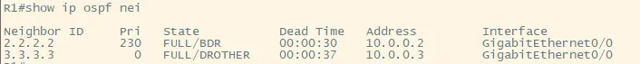

### R3

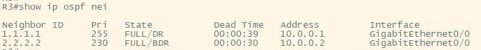

### R4

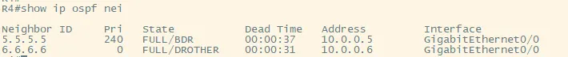

### R5

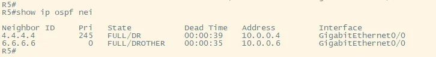

### R6

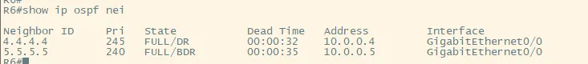

## Emerging two LANs

We connected two switches by cable. And we enable `debug ip ospf adj` and `debug ip ospf hello`.

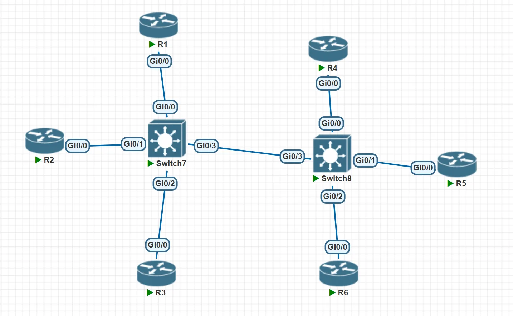

Waiting for the calculation, we showed the new OSPF relationship.

### R1

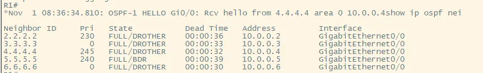

## Design case 2

### Configuration

**R1**

```bash
int g0/0
 ip add 10.0.0.1 255.255.255.0
 no shut
 ip ospf priority 255
int loo0
 ip add 1.1.1.1 255.255.255.255
 no shut
router ospf 1
 net 10.0.0.0 0.0.0.255 area 0
```

**R2**

```bash
int g0/0
 ip add 10.0.0.2 255.255.255.0
 no shut
 ip ospf priority 245
int loo0
 ip add 2.2.2.2 255.255.255.255
 no shut
router ospf 1
 net 10.0.0.0 0.0.0.255 area 0
```

**R3**

```bash
int g0/0
 ip add 10.0.0.3 255.255.255.0
 no shut
 ip ospf priority 0
int loo0
 ip add 3.3.3.3 255.255.255.255
 no shut
router ospf 1
 net 10.0.0.0 0.0.0.255 area 0
```

**R4**

```bash
int g0/0
 ip add 10.0.0.4 255.255.255.0
 no shut
 ip ospf priority 250
int loo0
 ip add 4.4.4.4 255.255.255.255
 no shut
router ospf 1
 net 10.0.0.0 0.0.0.255 area 0
```

**R5**

```bash
int g0/0
 ip add 10.0.0.5 255.255.255.0
 no shut
 ip ospf priority 240
int loo0
 ip add 5.5.5.5 255.255.255.255
 no shut
router ospf 1
 net 10.0.0.0 0.0.0.255 area 0
```

**R6**

```bash
int g0/0
 ip add 10.0.0.6 255.255.255.0
 no shut
 ip ospf priority 0
int loo0
 ip add 6.6.6.6 255.255.255.255
 no shut
router ospf 1
 net 10.0.0.0 0.0.0.255 area 0
```

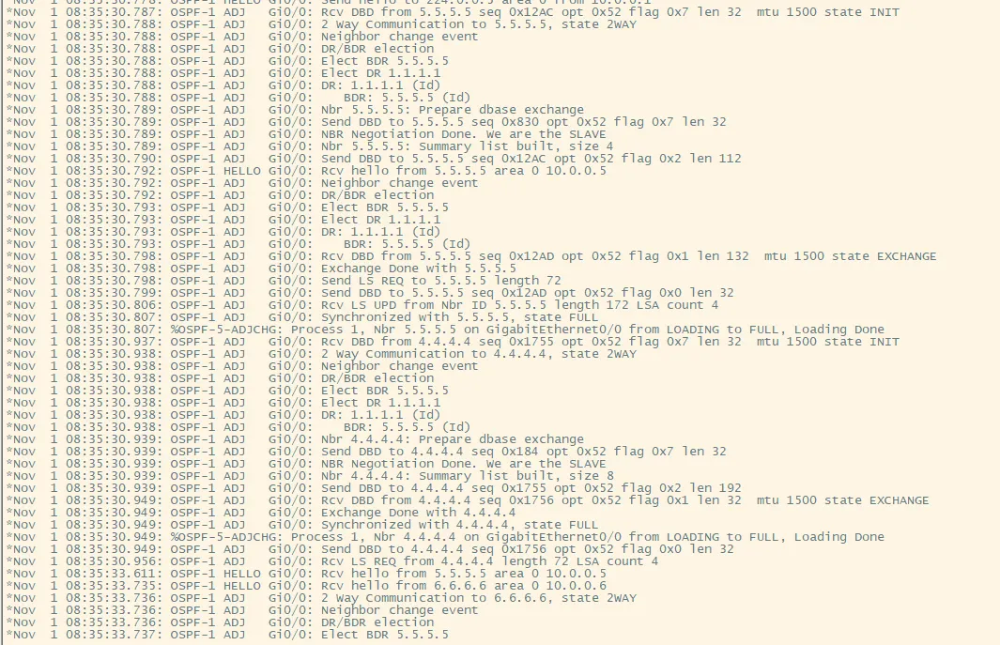

And we see the new OSPF relationship and debug info.

**R1:**

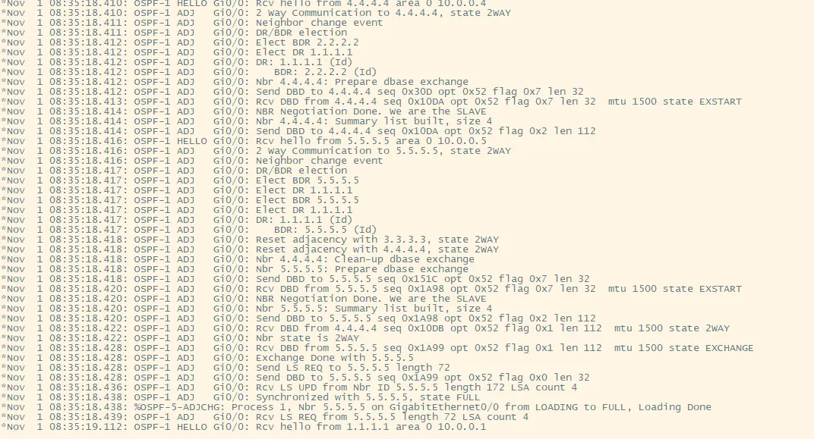

**R4:**

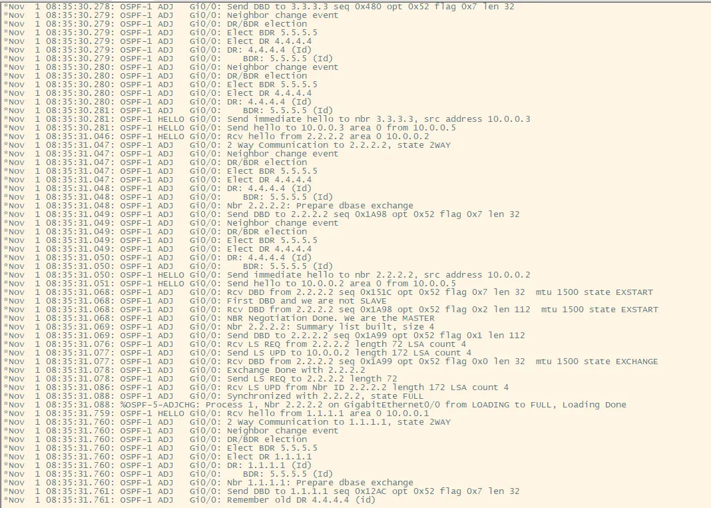


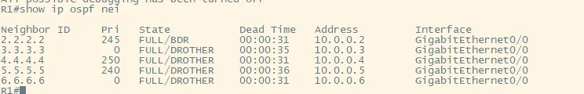


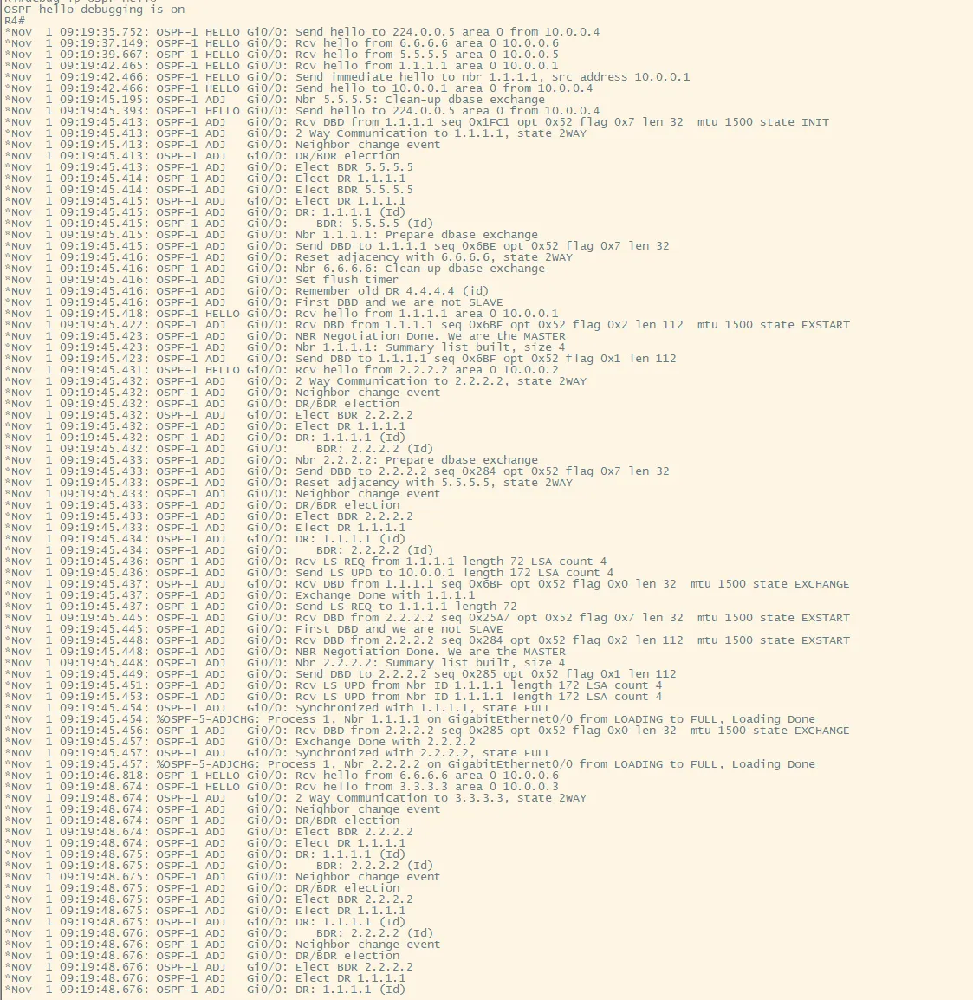

So I thought that the truth is DRs are compared to the new DR, and BDRs are compared to the new BDR.

What do you think about it? Looking forward to your reply.
