# Introduction

Hi, buddies, how's your day going? I know I haven't updated my blog in a long time, because I have been preparing for interviews. And I almost got the golden apple. Anyway, last week I posted a question that I said I would discuss further — how to subscribe to a multicast group across a unicast network. So, let's roll.

# Scenario

Alex is hired by a stock trading firm and assigned to a small branch office as an in-house network engineer. There are no traders sitting in this office, just administrative colleagues. Easy peasy, Japanesey. He feels very happy.

But one day, a trader went to this office temporarily and raised a ticket saying that he wanted to subscribe to a multicast group from the company's trading network infrastructure to get the trading data in real time.

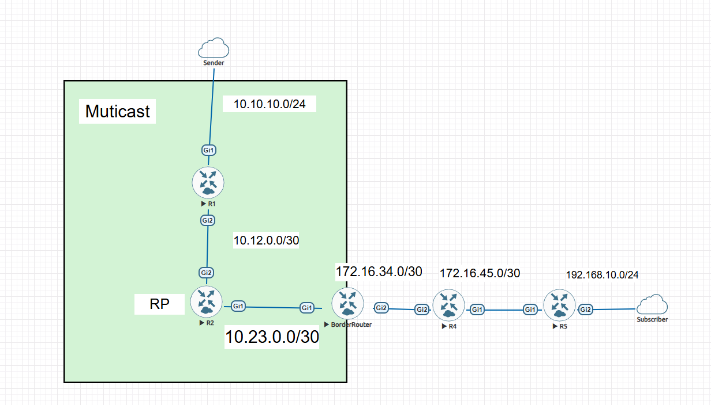

When Alex got this ticket, he was very distressed. Because the branch office network is unicast-only, only the border router and the gateway can enable multicast. He doesn't know what he's supposed to do.

How to help him?

# Solution

## Solution 1 — GRE tunnel

### Set up GRE

Please recall what you have learned from Cisco's books. You may remember that GRE tunnels can transmit multicast packets. If we set up a GRE tunnel on both the Border Router and the GW, the problem is solved.

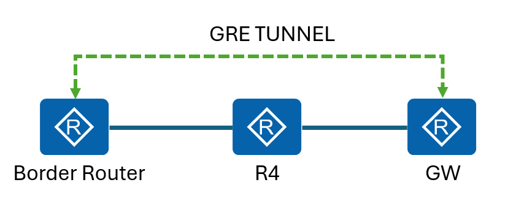

Alex thought so too. So he configured the tunnel and enabled PIM-SM on both routers. But when he had finished the configuration, the trader told him that he still had not received any trading data. Alex checked the mroute table on R5 and the Border Router, and he found something wrong.

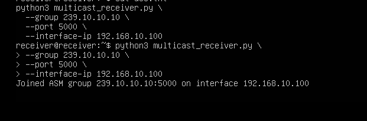

**IP mroute table on R5**

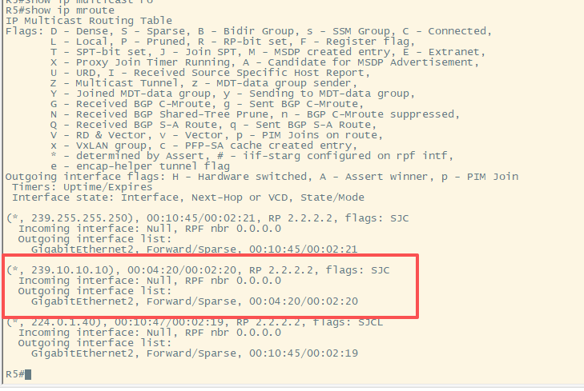

**R5 tunnel configuration**

```
interface Tunnel1
 ip address 192.168.200.2 255.255.255.0
 tunnel mode gre
 tunnel source 5.5.5.5
 tunnel destination 3.3.3.3
 ip pim sparse-mode
```

**Border Router tunnel configuration**

```
interface Tunnel1
 ip address 192.168.200.1 255.255.255.0
 tunnel mode gre
 tunnel source 3.3.3.3
 tunnel destination 5.5.5.5
 ip pim sparse-mode
```

### The missing configuration

Alex searched for information on the internet and found that he had ignored the RPF check mechanism.

**Alex checks the RPF**

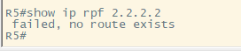

The answer is below:

> The multicast RPF check ensures a router only forwards multicast packets received on the interface it would use to reach the source, preventing loops and duplicate traffic.

Apparently, the RP (`3.3.3.3`) is learned from OSPF, so unicast routing does not match multicast routing. Alex was so glad that he found the root cause, and he fixed it with a static mroute for the source:

```
R5(config)# ip mroute 3.3.3.3 255.255.255.255 192.168.200.1
```

And then, the trader told Alex that he could receive the trading data, and praised him as the best network engineer.

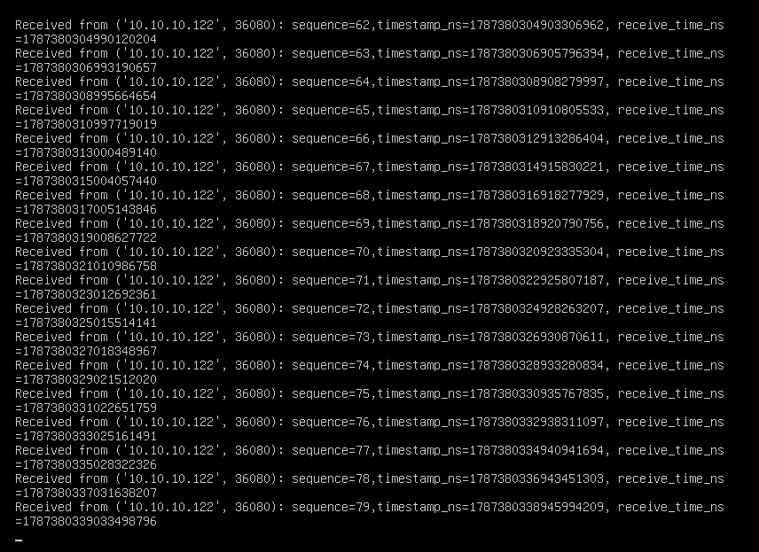

Alex is so happy, and he checked the RPF as displayed below:

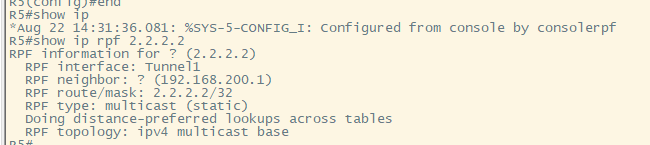

## Solution 2 — Automatic Multicast Tunneling

Alex was very curious whether there were any other solutions. And he actually found another solution for multi-site deployments that need to traverse a unicast network to join multicast groups, which is called **Automatic Multicast Tunneling** (AMT).

> The multicast source sends traffic to the first-hop. Multicast traffic flows through the network until it reaches the last-hop (receivers) or AMT relays. An AMT Relay is a multicast router configured to support transit routing between a non-multicast-capable internetwork and the native multicast infrastructure.
>
> The following diagram provides a sample AMT network where Relay1 and Relay2 are two AMT relays, which encapsulate the traffic into AMT tunnels, and send one copy to each of the AMT gateways.
>
> — [Cisco documentation](https://www.cisco.com/c/en/us/td/docs/ios-xml/ios/ipmulti_pim/configuration/xe-16/imc-pim-xe-16-book/imc-auto-mlt-tun.html)


AMT has a limitation: AMT only supports SSM mode for PIM signaling.

Alex found that they have an SSM group on the trading network. So he decided to test this solution for joining an SSM group.

**R5**

```
interface Tunnel1
 ip address 192.168.200.2 255.255.255.0
 ip pim passive
 ip igmp version 3
 tunnel source Loopback0
 tunnel mode udp ip
 tunnel destination dynamic
 tunnel dst-port dynamic
 tunnel src-port dynamic
 amt gateway traffic ip
 amt gateway relay-address 3.3.3.3
```

**Border Router**

```
interface Tunnel1
 ip address 192.168.200.1 255.255.255.0
 no ip redirects
 ip pim sparse-mode
 ip igmp version 3
 tunnel source Loopback0
 tunnel mode udp multipoint
 tunnel dst-port dynamic
 tunnel src-port dynamic
 amt relay traffic ip
```

When Alex had finished the configuration, he verified the specific mroute and checked the SPT on all routers.

**Mroute table on R5**

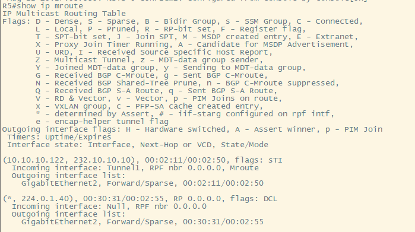

**Mroute table on the Border Router**

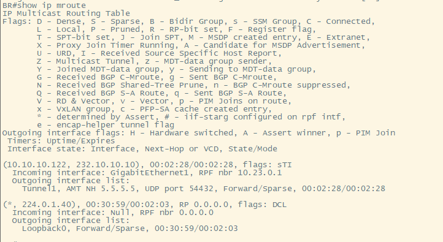

**Mroute table on R1 (FHR)**

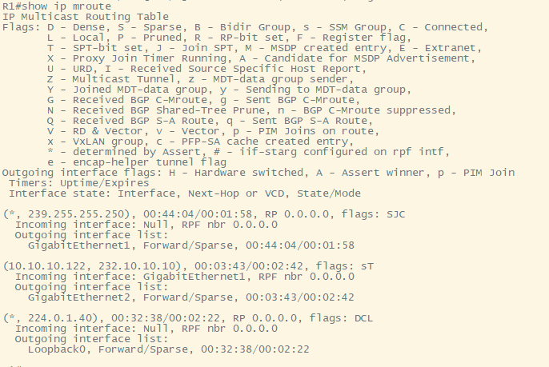

The SPT was created successfully. And the trader said that he could receive the trading data from the SSM group.

**Trading data from SSM**

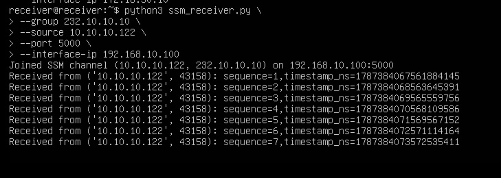

It is amazing, isn't it? All roads lead to Rome.

After completing this change, Alex received a notification from company headquarters that he was to be transferred to the trading network infrastructure team to take on more important responsibilities.

# Question

Given this scenario, we have GRE and AMT as solutions. So could you explain the pros and cons of the two solutions?
