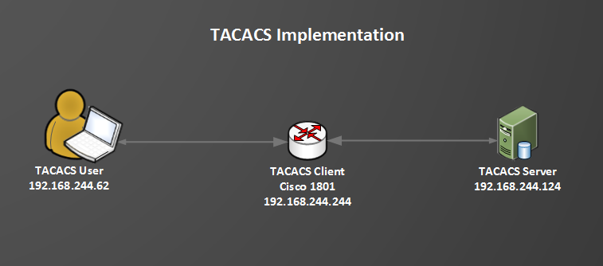
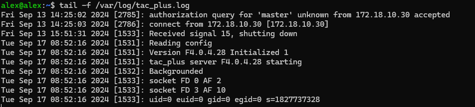
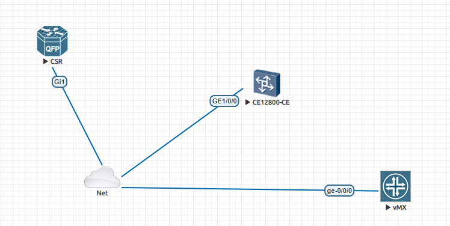
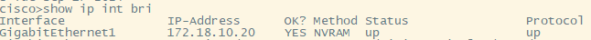
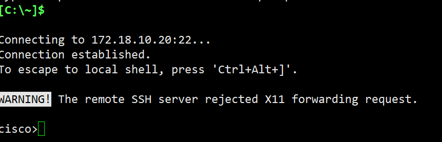

If we have a lot of devices in our network architecture to control, we cannot create a login account for each device. It is so hard to log in to every device to create an account. This way is cumbersome and inconvenient. In the current network, we usually use the tacacs server to log in devices conveniently such as Cisco ISE or HUAWEI imaster. But those platforms are commercial software. If your company does not want to buy them, you can try some free tacacs server such as tacacs_plus.

Tacacs_plus is an open-source software that makes it easy to use one account to log in to all devices. I recommend using Ubuntu20.04 to install tacacs_plus. Install it using the compile and install method.



## How to download the file about tacacs_plus

### Downloading file

When you log into the Ubuntu server, using the command:

```bash
sudo wget ftp://ftp.shrubbery.net/pub/tac_plus/tacacs-F4.0.4.28.tar.gz
```

## Using "make" to install tacacs_plus

### Install libwrap0-dev flex bison

Because we use source code to install it, we need these tools to compile source codes.

libwrap0-dev provides access control to web services based on client hostnames or IP addresses, while flex and bison are tools for generating lexical analyzers and parsers for programming languages.

Using the command to install those tools:

```bash
sudo apt-get install libwrap0-dev flex bison
```

### Decompress file

Using the command to decompress tacacs_plus:

```bash
sudo tar -zxvf tacacs-F4.0.4.28.tar.gz
```

### Configure setting file

Using the command to configure the compile setting:

```bash
sudo ./configure
```

### Compile code

Using the command to compile and install:

```bash
sudo make install
```

### Add lib path

The lib we used is installed in /usr/lib so that we should add lib path.

```bash
sudo vi /etc/ld.so.conf
```

or

```bash
sudo nano /etc/ld.so.conf
```

It depends on what editor you have.

When you open this file, you should edit this configuration as below:

```
include /etc/ld.so.conf.d/*.conf
/usr/lib
```

Saving changes and exit, then run the command as below:

```bash
sudo ldconfig
```

## Create settings and run the program

### Creating setting

Using this command:

```bash
sudo nano /etc/tacacs+/tac_plus.conf
```

The edit configuration as below:

```
#Make this a strong key, pre-share key
key = 12345678

#Am using local PAM which allows us to use local linux users, you can use any backend like Windows AD
default authentication = file /etc/passwd

#Define groups that we shall add users to later
#In this example I have defined 2 groups support and unicorns and assign them respective privileges

#*************************
#***USERS ACCOUNTS HERE***
#*************************
#
#add users in linux group. Because tacacs_plus will use linux authentication rules.
#
user = master {
        member = Network_Engineers    #group configuration
}

user = node1 {
        member = Field_Techs
}

user = node2 {
        member = Managers
}

#*************************
#***   GROUPS HERE     ***
#*************************

group = Network_Engineers {
        default service = permit    #This option is used to Author
        login = file /etc/passwd    #This option is uesd linux authentication
        enable = file /etc/passwd
}

#make rules for cmd
group = Field_Techs {
        default service = deny
        login = file /etc/passwd
        enable = file /etc/passwd
        service = exec {
        priv-lvl = 2
        }
        cmd = enable {
                permit .*
        }
        cmd = show {
                permit .*
        }
        cmd = do {
                permit .*
        }
        cmd = exit {
                permit .*
        }
        cmd = configure {
                permit terminal
        }
        cmd = interface {
                permit .*
        }
        cmd = shutdown {
                permit .*
        }
        cmd = no {
                permit shutdown
        }
        cmd = speed {
                permit .*
        }
        cmd = duplex {
                permit .*
        }
        cmd = write {
                permit memory
        }
        cmd = copy {
                permit running-config
        }
}

group = Managers {
        default service = deny
        login = file /etc/passwd
        enable = file /etc/passwd
        service = exec {
        priv-lvl = 2
        }
        cmd = enable {
                permit .*
        }
        cmd = show {
                permit .*
        }
        cmd = exit {
                permit .*
        }
}
```

### Running program

Using the command as below:

```bash
sudo tac_plus -C /etc/tacacs+/tac_plus.conf -t -d 1
```

### Checking log

```bash
tail -f /var/log/tac_plus.log
```



### Add users

Because tacacs is based on linux user, so you should add user in linux:

```bash
adduser master
adduser node1
adduser node2
```

You can see the tacacs status in the log output above.

## Log in devices to check it out

I've used eve-ng to make a lab:





When I log in Cisco switch:



It worked well~
