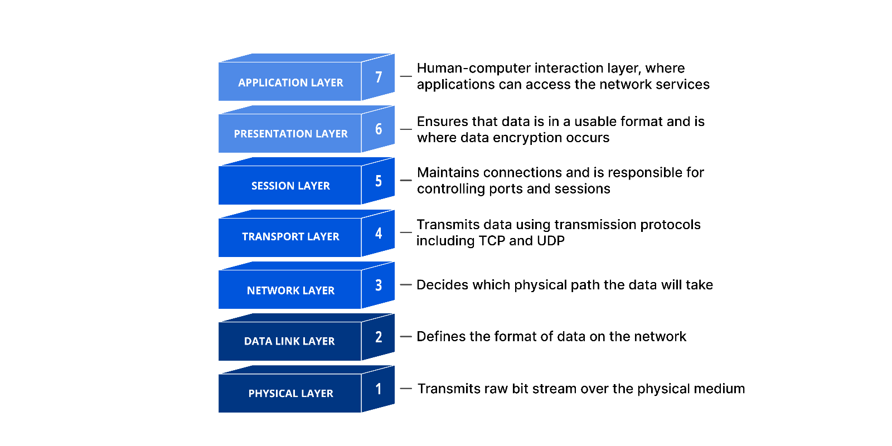

How to troubleshoot effectively? This is a regular question in a lot of interviews. As network engineers, we always face a vast number of network issues. We need to ensure that the network is running properly and smoothly. But there are many types of network faults, so how can we pin them quickly?

## Check what was changed before the previous network problem

Many failures are caused by improper operation. When the network issue has occurred, we should ask what was changed before. Checking the log and previous configurations, you might find the problems so that you can rollback configurations that cause those issues.

## The log will tell you what the problem is

The log may not tell you directly what the problem is. But they can show you what happened. For example, if you want to make two routers have an OSPF connection but they haven't because of you configured the wrong router-id. When you check the log, you will see the information below:

```
%OSPF-4-DUP_RTRID: Detected router with duplicate router ID x.x.x.x in area X
%OSPF-4-CONFLICTING_RTRID: Router detected another router with duplicate router ID x.x.x.x
```

Then you will find what mistake you make and fix it. So we shouldn't ignore logs, which can give us useful information.

## Follow the OSI model to identify network issues

If the above two points do not identify the problem, we need to rely on the OSI model to locate the problem. I know some engineers think the OSI model is useless. Because they feel it's too abstract. I would say that whether it works or not, it is always optimal to follow this model to troubleshoot.

We are supposed to think previously where the problem is located. We then use the model to troubleshoot the problem layer by layer. For example, if a host can not connect to the internet, we can start troubleshooting at the first layer. We should check if the physical network cable is working. It is working normally? OK, we check the configuration of the port of the switch. If it is ok? Good, we check out the network layer. When we go layer by layer, we always find a problem.



## Segmented approach to troubleshooting

A segmented approach is the best way to find problems. Troubleshooting network segments by elimination. For example, we can test the connection between the host and gateway. If it is ok, we test the connection between the gateway and the internet router (or load-balance). Using this approach, we can progressively limit the problem to a certain link.

## There will always be problems we can't solve

People have their limitations. We can not solve every issue in the network. Your patience and your unyielding spirit is the most valuable factor in solving the problem. I know there are times when a situation is urgent and the Internet connection needs to be restored. But it's hard to find problems quickly. The more this happens, the less we can panic. Take a deep breath, calm your mind, and carefully analyze the data to determine the problem. And we have to be good at utilizing our team. There is no shame in asking for help at all.

**Above all, keep learning, keep sharing.**
