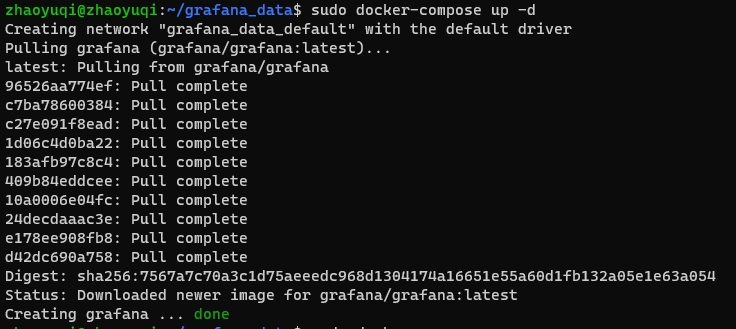
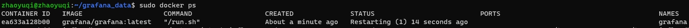
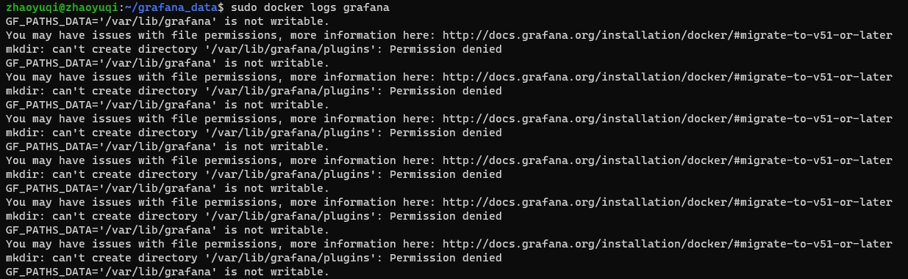
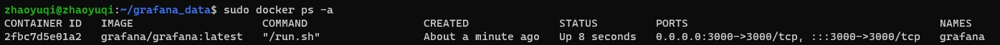

## Create a directory with root authority

```bash
sudo mkdir grafana_data
```

### Check


## Create a compose file

```bash
sudo nano docker-compose.yml
```

### Write config

```yaml
version: '3'
services:
  grafana:
    image: grafana/grafana:latest
    container_name: grafana
    restart: always
    ports:
      - 3000:3000
    volumes:
      - /home/zhaoyuqi/grafana_data:/var/lib/grafana
```

### Run this config file

```bash
sudo docker-compose up -d
```



But I found the image failed to run:



After checking the log, it is found that the file permission error causes the operation failure:

```bash
sudo docker logs grafana
```



## Modifying folder permissions

```bash
sudo chown -R 472:472 /home/zhaoyuqi/grafana_data
```

## Restart image, it has run properly

```bash
sudo docker-compose up -d
```


