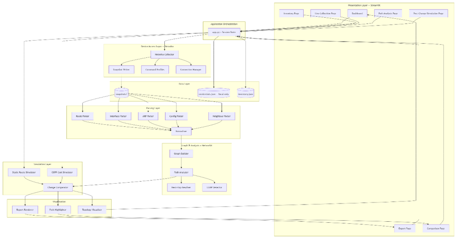
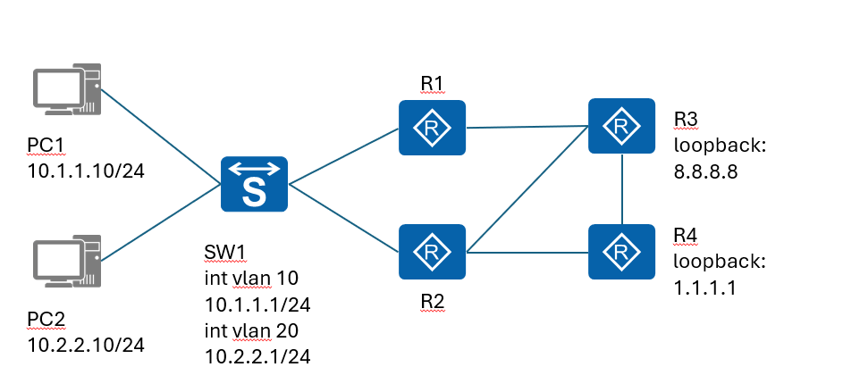
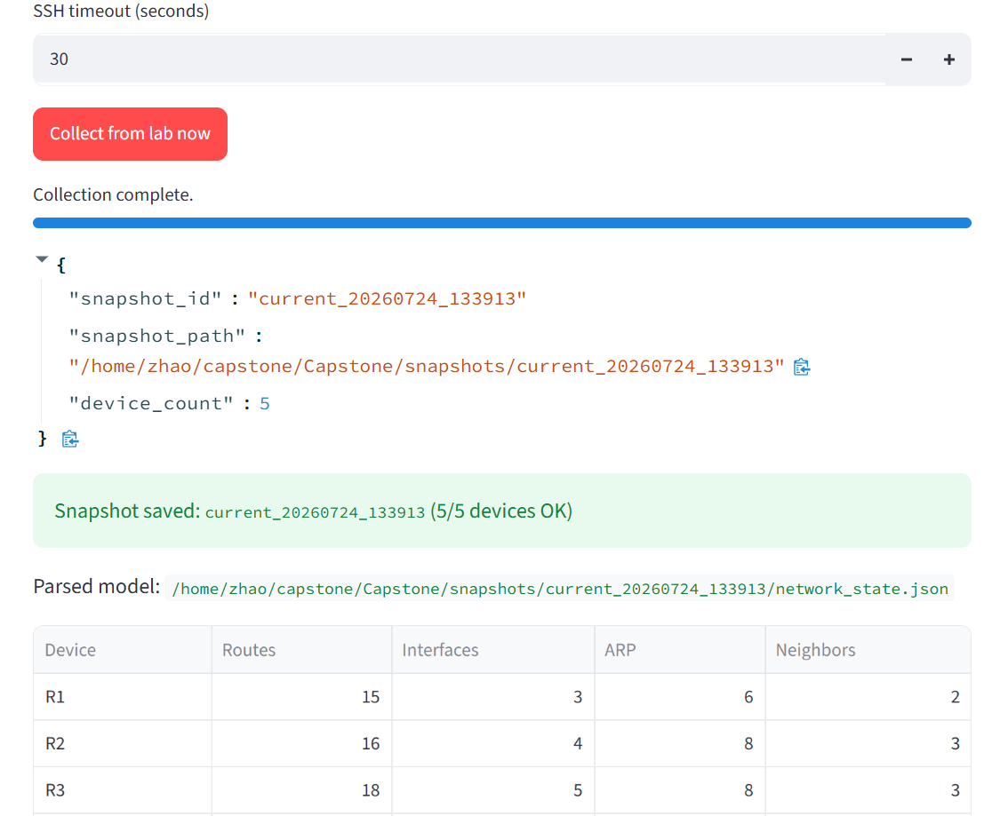
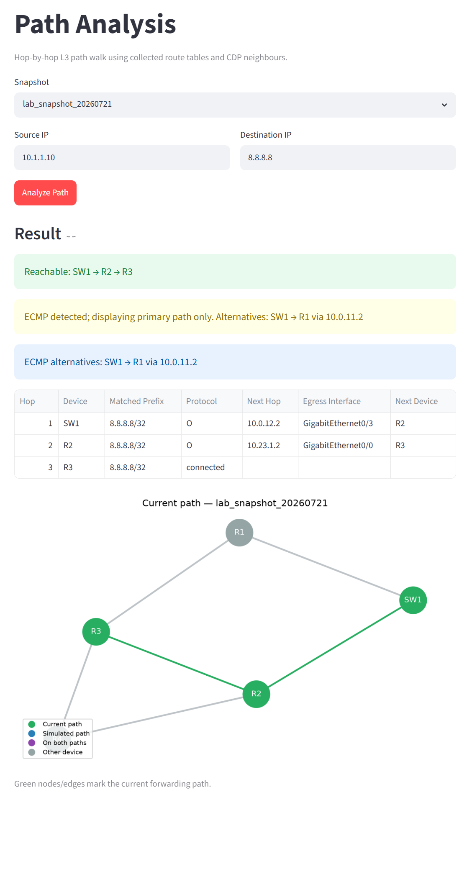
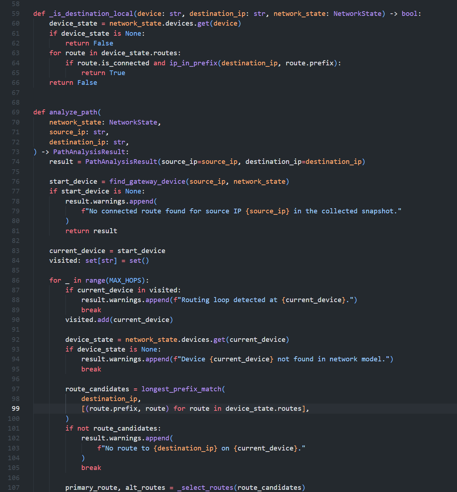
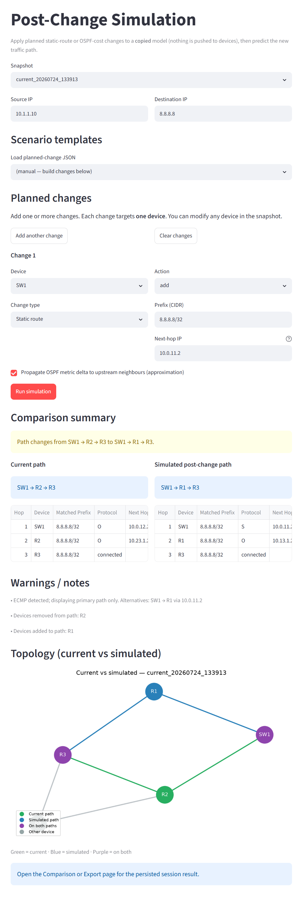
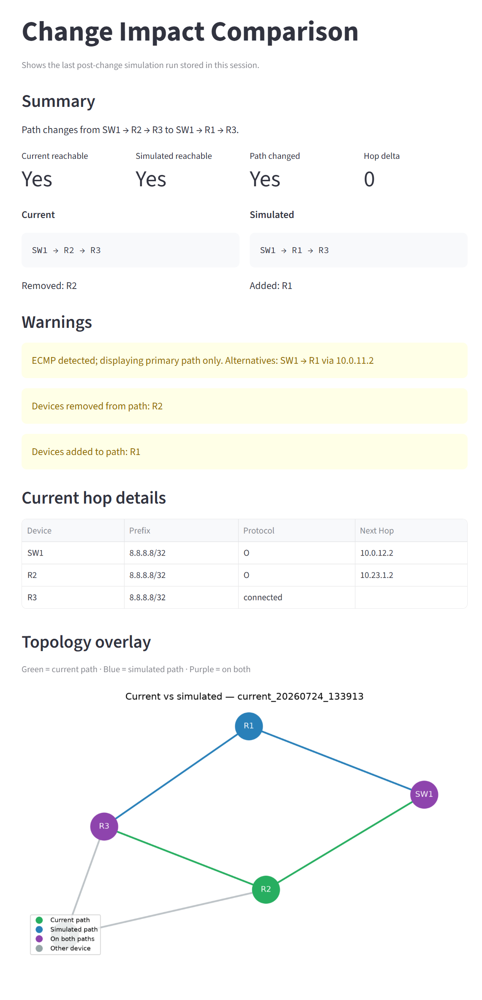
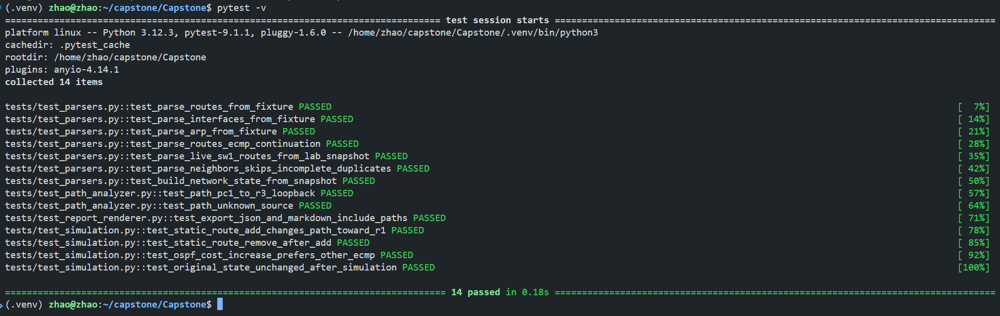
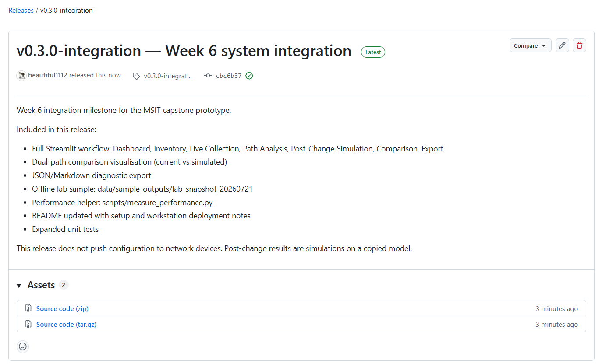
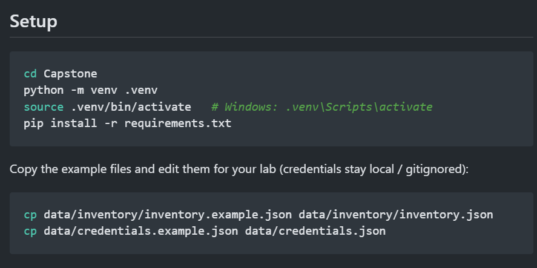

This page is my public portfolio entry for the University of the People MSIT 5910 Capstone project. It shows the working prototype, repository layout, screenshots, and how to run the tool. The graded academic report stays in the course submission system and is not published here.

**Code repository:** [msit-capstone-network-tool](https://github.com/beautiful1112/msit-capstone-network-tool)  
**Author:** Alex Zhao (Yuqi Zhao)

## Problem

When engineers plan static-route or OSPF cost changes, they often need a clear answer to two questions before the change window:

1. What is the **current** forwarding path between a source and a destination?
2. How would that path change if we applied a planned Layer 3 update?

Relying only on saved configuration files can drift from the live control plane. This prototype uses **live operational state** (routing tables, interfaces, ARP, CDP neighbours) as the baseline, then simulates the planned change on a **copied model** without pushing configuration to devices.

## What the tool does

| Capability | Implementation |
|------------|----------------|
| Live collection | Netmiko SSH to Cisco IOS-style devices |
| Parsing | TextFSM templates for route / interface / ARP / neighbour output |
| Topology model | NetworkX graph built from collected state |
| Current-path analysis | Hop-by-hop longest-prefix match, AD/metric preference, ECMP warning |
| Post-change simulation | Static route add/modify/remove; OSPF interface cost change (approx.) |
| Comparison | Current vs simulated path, added/removed devices, reachability |
| UI | Streamlit pages: Inventory, Collection, Path Analysis, Simulation, Comparison, Export |
| Quality | PyTest suite + GitHub Actions CI |

The tool **does not** push configuration. It is a read-and-simulate assistant for pre-change review.

## System architecture



Layers from device access through parsing, NetworkX analysis, simulation, and Streamlit presentation. Credentials stay local (`credentials.json` is gitignored).

## Lab topology



Canonical demo lab: PC1 `10.1.1.10`, PC2 `10.2.2.10`, Layer-3 SW1, routers R1–R4 with OSPF. Example demo path: `10.1.1.10` → `8.8.8.8` observed as **SW1 → R2 → R3** (ECMP also via R1).

## Live collection



Netmiko walks the inventory, runs a command profile per platform, and writes a snapshot under `snapshots/`. Parsed state lands in `network_state.json` for offline analysis and tests.

Collector entry point (simplified):

```python
def collect_live_state(
    inventory: list[dict[str, Any]],
    credentials: dict[str, str],
    snapshots_dir: str = "snapshots",
    timeout: int = 30,
) -> dict[str, Any]:
    writer = SnapshotWriter(snapshots_dir)
    # For each device: open Netmiko session, run command profile, write snapshot
    ...
```

## Path analysis



Given a snapshot, source IP, and destination IP, the analyser finds the gateway for the source, then walks hop-by-hop using longest-prefix match on each device’s route table.

```python
def analyze_path(
    network_state: NetworkState,
    source_ip: str,
    destination_ip: str,
) -> PathAnalysisResult:
    start_device = find_gateway_device(source_ip, network_state)
    # Hop loop: LPM → prefer AD/metric → resolve next-hop device via CDP/ARP
    ...
```



## Post-change simulation and comparison





Example: after simulating a static / OSPF adjustment on SW1, the comparison page reports a path shift from **SW1 → R2 → R3** to **SW1 → R1 → R3**, with hop tables and a colour-coded topology overlay (green = current, blue = simulated).

## Testing and CI



Unit tests cover parsers, path analysis, simulation, and export helpers. GitHub Actions runs PyTest on push/PR to `main` and `development`.



## Repository layout (from README)

```text
├── README.md
├── requirements.txt
├── src/
│   ├── app.py              # Streamlit entry
│   ├── pages/              # Dashboard, inventory, collection, analysis, …
│   ├── collector/          # Netmiko live collection
│   ├── parser/             # TextFSM CLI parsers
│   ├── model/              # Network state + NetworkX graph
│   ├── analysis/           # Path analysis + comparison
│   ├── simulation/         # Static / OSPF change simulation
│   └── visualization/      # Topology figures + report export
├── data/                   # Inventory examples, sample snapshots, planned changes
├── tests/
└── scripts/measure_performance.py
```

## How to run (quick start)



```bash
git clone https://github.com/beautiful1112/msit-capstone-network-tool.git
cd msit-capstone-network-tool   # or Capstone/ depending on clone layout
python -m venv .venv
source .venv/bin/activate
pip install -r requirements.txt

cp data/inventory/inventory.example.json data/inventory/inventory.json
cp data/credentials.example.json data/credentials.json
# edit credentials locally — never commit them

streamlit run src/app.py
# optional live collect:
# python -m src.cli.collect --inventory data/inventory/inventory.json
pytest -v
```

Full setup notes: [README on GitHub](https://github.com/beautiful1112/msit-capstone-network-tool#readme).

## Portfolio artifacts on this page

| Artifact | Where |
|----------|--------|
| Prototype / code | GitHub repository (link above) |
| Architecture diagram | Cover image on this post |
| Screenshots | Collection, path analysis, simulation, comparison |
| README / setup | Excerpt + GitHub README |
| Demo video | Link below (update after upload) |
| Design summary | Architecture section (sanitized; no private academic draft) |
| Full graded report | **Not published** — course submission only |


## Security notes

- Device credentials and live snapshots are local / gitignored.
- Prefer read-only lab accounts where possible.
- The prototype never writes configuration to network devices.

## Links

- GitHub: https://github.com/beautiful1112/msit-capstone-network-tool  
- LinkedIn: https://www.linkedin.com/in/alex-zhao-05ab54275  

