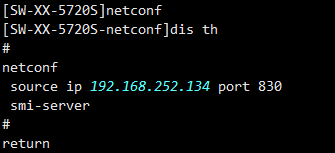
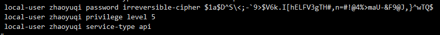
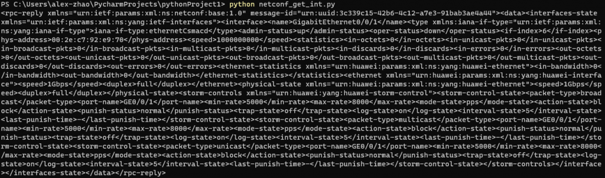
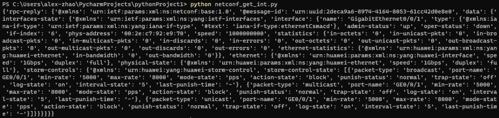
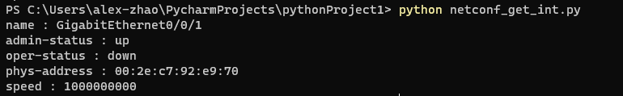

With more and more network equipment, we have lot of vendors. Recently I came up with the idea of making a cross-vendor SDN controller. After learning Python, I stumbled my way to NetDevOps. First of all, I would like to thank the authors Wang Yin and Zhu Jiasheng. It was they who introduced me to the new field of network operation automation.

Different vendors have different API interfaces for their devices. However, most of their devices comply with the RFC standard and support NETCONF protocol for device interaction. I recently selected Huawei S5720S-28P-SI-AC for NETCONF experiment, and used the ncclient module in Python for device communication.

## What is NETCONF

NETCONF is a network protocol developed and standardized by the Internet Engineering Task Force (IETF). So far, IETF has published multiple Requests For Comments (RFCs) related to NETCONF, including RFC 6241 (NETCONF Protocol) and RFC 6020 (YANG — A Data Modeling Language for the Network Configuration Protocol). These standards regulate the basic syntax and operation of the NETCONF protocol, as well as the specification of the YANG data model.

NETCONF is being supported by more and more network equipment vendors, such as Cisco, Huawei, Juniper, and others. This cross-platform API gives us a ripe condition to develop customized, cross-vendor SDN controllers.

Simply, NETCONF is a unified API that allows you to interact with devices without having to worry about command differences between vendors.

*For example, the command for obtaining device configuration is `show run` for Cisco and `display cur` for Huawei.*

**The same is true if you use NETCONF's GET method.**

## Introduction to YANG Model

YANG is a network data modeling language based on XML. It is a file that defines data models and module structures for modeling data in network devices and protocols. Each YANG model consists of one or more modules, each containing declarations that describe the data, attributes, and relationships in the device or protocol.


The YANG model based on XML is a tree structure with layers of nesting, much like HTML.

For example, an XML file that gets port information looks like this:

```xml
<?xml version='1.0' encoding='UTF-8'?>
<rpc message-id="1" xmlns="urn:ietf:params:xml:ns:netconf:base:1.0">
  <get>
    <filter type="subtree">
      <if:interfaces-state xmlns:if="urn:ietf:params:xml:ns:yang:ietf-interfaces">
        <if:interface>
          <if:name>XGigabitEthernet0/0/3</if:name>
        </if:interface>
      </if:interfaces-state>
    </filter>
  </get>
</rpc>
```

Where `<?xml version='1.0' encoding='UTF-8'?>` is the declaration that the XML file must include, containing the version of the XML file and the encoding format.

`<rpc message-id="1" xmlns="urn:ietf:params:xml:ns:netconf:base:1.0">` — NETCONF is based on RPC protocol for interaction. `message-id="1"` is the mandatory attribute of an RPC message, usually counting from 1, serving as an identifier. It is a bit like SYN in TCP.

In the NETCONF protocol, all XML elements and attributes must use a namespace to identify the NETCONF module to which they belong. According to the NETCONF standard, all NETCONF internal elements and attributes use the `urn:ietf:params:xml:ns:netconf:base:1.0` namespace. Therefore, if there is no other namespace declared in the XML document, the default namespace will be `urn:ietf:params:xml:ns:netconf:base:1.0`.

So what is a namespace? Wikipedia says that "namespaces are a special abstraction of scopes." For example, A and B work in different companies. A's work number is 001, and B's work number is also 001, but they belong to different companies, so there is no confusion. These two different companies are the namespaces that specify the scope.

## The first little experiment

**Experimental objective:** Use the ncclient module to carry out NETCONF interaction, obtain the information of G0/0/1 port, and process the XML text in the output.

**Experimental tools:** Python, S5720S-28P-SI-AC

**Preparation for experiment:**

1. Enable NETCONF. Although the default NETCONF port is 830, you need to run the command again in the NETCONF view to specify the port. Otherwise, the port does not take effect.





**Experimental code:**

In this experiment, the ncclient module was used to interact with the device, which provides a convenient set of Python interfaces for building and parsing NETCONF messages, as well as handling XML and YANG data types. Also, since the returned information is based on XML formatted text, we use the xmltodict module to process XML formatted text for readability.

### 1. Connect to the device and push NETCONF messages

```python
from ncclient import manager
import xmltodict

# Define device connection information
huawei_device = {
    'host': '192.168.252.134',
    'username': 'zhaoyuqi',
    'password': '**********',
    'port': 830,
    'device_params': {'name': 'huaweiyang'},
    'hostkey_verify': False,
    'look_for_keys': False,
}

# Define XML-format NETCONF command
xml_filter = '''
    <filter type="subtree">
      <interfaces-state xmlns="urn:ietf:params:xml:ns:yang:ietf-interfaces">
        <interface>
          <name>GigabitEthernet0/0/1</name>
        </interface>
      </interfaces-state>
    </filter>
'''

# Connect to the device and send the NETCONF command
with manager.connect(**huawei_device) as m:
    response = m.get(xml_filter)
```

In this code, we define a dictionary `huawei_device`, which is then used as an argument to the `connect` method. `xml_filter` constructs a message body conforming to the NETCONF format. As you can see, there is no need to declare the version and namespace of the XML in the message body, because the ncclient module constructs the standard message body for us.

In the NETCONF protocol, the filter node is the key node used to specify the specific data to get or manipulate. The filter has two important attributes: `type` and `select`, which determine the type and parameters of the filter. Use the filter when you want to get a partial XML document rather than the entire document. There are two common filter types: XPath filters and subtree filters.

`type="subtree"` indicates that the filter attribute is a subtree filter. XPath filters are not recommended because they burden the device.

`xmlns="urn:ietf:params:xml:ns:yang:ietf-interfaces"` is a namespace declaration. It declares that the following elements and attributes belong to the ietf-interfaces namespace.

Finally, the `connect` method is used to push the message to the device and get the device echo.

If we print out `response`:

```python
print(response)
```

You can see the following information:



You can see that the device also replies with an XML message. (You can use an XML tool to redisplay this echo code into a readable structure.)

### 2. Convert the XML response to a dictionary

We need to convert the XML text into dictionary format by adding the following code:

```python
response_dict = xmltodict.parse(response.xml)
print(response_dict)
```



As you can see, it has been converted to layers of nested dictionary format text. We use a for loop to go through the dictionary and print out the information that we want. Add the following code:

```python
interface = response_dict['rpc-reply']['data']['interfaces-state']['interface']
if isinstance(interface, list):
    interface = interface[0]

for key in ('name', 'admin-status', 'oper-status', 'phys-address', 'speed'):
    if key in interface:
        print(f'{key} : {interface[key]}')
```

When we execute the script, we can see that the output is the information we want:



## Summary

In the above small experiments, we used the ncclient module for device interaction, pushing NETCONF messages and obtaining device echo. We then used the xmltodict module to process the text in XML format and eventually output the result we wanted.

The core function of an SDN controller must be configuration delivery, so in the next article, I will conduct a configuration modification experiment.
