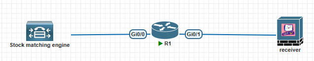

# Introduction

The trading network architecture is the most mysterious network in the world. We only know there are multicast and low-latency networks, but we don’t know the details about them. How to connect with each other? Which multicast protocols do they use? What is the real-world network model in the trading field?

I am a layman in this field, but we have AI. I’ve asked questions with AI(specific Gemini2.5 pro & GPT-5). AI gave me some feedback, and I imagined by myself to build some scenarios for the trading network. Maybe I have grasped the key in this field? maybe…

So, if I have something wrong, please correct me.

# How to simulate a stock engine and a trading receiver?


Since I use EVE-NG, I created two VMs by Ubuntu to simulate trading servers. And you can add two cloud connections on EVE-NG, associating with two servers.

## Stock matching engine

This is a server from stock exchanges to propagate stock data to brokers and trading firms. I don’t know any specific details about that. So I just created a Ubuntu server(22.04) and used Python to simulate a matching engine. I wrote a script to generate stock data randomly and send it to a designated multicast group.

Here is the code(of course, codes from AI, lmao~):

```python
import socket
import time
import random
import struct
import json

# --- Configuration ---
SENDER_INTERFACE_IP = '172.18.10.122'  # <--- SET THE IP OF THE DESIRED SENDING NIC
MULTICAST_GROUP = '239.1.1.1'
MULTICAST_PORT = 12345
SEND_INTERVAL_SECONDS = 1

def create_sender_socket():
    """Creates and configures a UDP socket for sending multicast messages from a specific interface."""
    # Create a UDP socket
    sock = socket.socket(socket.AF_INET, socket.SOCK_DGRAM)

    # Set the Time-to-Live (TTL) for messages.
    ttl = struct.pack('b', 3)
    sock.setsockopt(socket.IPPROTO_IP, socket.IP_MULTICAST_TTL, ttl)

    # --- This is the key line for selecting the interface ---
    # It works for ANY multicast routing protocol (PIM-SM, SSM, etc.)
    print(f"Binding sender to interface: {SENDER_INTERFACE_IP}")
    sock.setsockopt(socket.IPPROTO_IP, socket.IP_MULTICAST_IF, socket.inet_aton(SENDER_INTERFACE_IP))
    
    return sock

def generate_trade_data():
    """Generates a random mock trade data dictionary."""
    tickers = ['AAPL', 'GOOG', 'MSFT', 'AMZN', 'TSLA']
    trade = {
        'ticker': random.choice(tickers),
        'price': round(random.uniform(100.0, 500.0), 2),
        'volume': random.randint(10, 1000),
        'timestamp': time.time()
    }
    return trade

def main():
    """Main loop to send trading data."""
    print(f"Starting multicast sender for group {MULTICAST_GROUP}:{MULTICAST_PORT}")
    sender_socket = create_sender_socket()
    
    try:
        while True:
            trade_data = generate_trade_data()
            message = json.dumps(trade_data).encode('utf-8')
            
            sender_socket.sendto(message, (MULTICAST_GROUP, MULTICAST_PORT))
            
            print(f"Sent: {trade_data}")
            
            time.sleep(SEND_INTERVAL_SECONDS)
            
    except OSError as e:
        if e.errno == 19: # "No such device"
            print(f"\\nError: The IP address {SENDER_INTERFACE_IP} is not configured on any interface on this host.")
        else:
            print(f"An OS error occurred: {e}")
    except KeyboardInterrupt:
        print("Sender stopped.")
    finally:
        sender_socket.close()

if __name__ == '__main__':
    main()


```

## Trading firm receiver

This is a server from a trading firm, which is used to receive trading data. I also use Ubuntu and Python to join a specific multicast group.

Here is the code:

```python
import socket
import struct
import json

# --- Configuration ---
# *** VERIFY THIS IP ADDRESS IS CORRECT ***
# This must be the IP of the network card connected to the switch.
# On Linux, use 'ip addr'. On Windows, use 'ipconfig'.
LISTENING_INTERFACE_IP = '192.168.10.100'  # <--- DOUBLE-CHECK THIS VALUE

MULTICAST_GROUP = '239.1.1.1'
MULTICAST_PORT = 12345

def create_receiver_socket():
    """Creates and configures a UDP socket to receive multicast on a specific interface."""
    sock = socket.socket(socket.AF_INET, socket.SOCK_DGRAM)
    sock.setsockopt(socket.SOL_SOCKET, socket.SO_REUSEADDR, 1)
    sock.bind(('', MULTICAST_PORT))

    group = socket.inet_aton(MULTICAST_GROUP)
    local_if_ip = socket.inet_aton(LISTENING_INTERFACE_IP)
    mreq = struct.pack('4s4s', group, local_if_ip)

    print(f"Joining multicast group {MULTICAST_GROUP} on interface {LISTENING_INTERFACE_IP}...")
    # This is the command that sends the IGMP Join message
    sock.setsockopt(socket.IPPROTO_IP, socket.IP_ADD_MEMBERSHIP, mreq)
    
    return sock

def main():
    """Main loop to receive and process multicast data."""
    try:
        # MODIFICATION: Added error handling for socket creation
        receiver_socket = create_receiver_socket()
    except OSError as e:
        print(f"\\n[ERROR] Failed to create socket: {e}")
        print(f"--> Please verify that '{LISTENING_INTERFACE_IP}' is the correct IP address for a network card on this machine.")
        return # Exit the script if the socket can't be created

    print("\\nReceiver is running. Waiting for data...")
    
    try:
        while True:
            data, address = receiver_socket.recvfrom(1024)
            message = json.loads(data.decode('utf-8'))
            print(f"Received from {address[0]}:{address[1]} -> {message}")

    except KeyboardInterrupt:
        print("\\nReceiver stopped by user.")
    finally:
        # Ensure the socket is closed if it was successfully created
        if 'receiver_socket' in locals() and receiver_socket:
            receiver_socket.close()

if __name__ == '__main__':
    main()


```

If we want to use PIM-SSM, we should modify the script as below:

```python
import socket
import struct
import json

# --- Configuration ---
# *** MANUALLY SET THE IP OF THE NIC YOU WANT TO LISTEN ON ***
# You must find this IP yourself (e.g., using 'ip addr' or 'ifconfig' in your terminal)
LISTENING_INTERFACE_IP = '192.168.10.100' # <--- Example: The IP of your 'eth1'

# *** SET THE EXPECTED SOURCE (SENDER) IP ADDRESS ***
# This is the 'S' in the (S,G) channel join
SOURCE_IP = '172.18.10.122' 

# Multicast Group ('G') and Port
MULTICAST_GROUP = '239.1.1.1'
MULTICAST_PORT = 12345

def create_ssm_receiver_socket():
    """
    Creates a UDP socket to receive SSM data on a specific, manually configured IP interface.
    """
    # Create a standard UDP socket
    sock = socket.socket(socket.AF_INET, socket.SOCK_DGRAM)

    # Allow the port to be reused by other sockets if necessary
    sock.setsockopt(socket.SOL_SOCKET, socket.SO_REUSEADDR, 1)

    # Bind the socket to the multicast port on all available interfaces.
    # The OS will use the subsequent membership call to filter traffic.
    sock.bind(('', MULTICAST_PORT))

    # --- CORE LOGIC for SSM on a SPECIFIC interface ---
    
    # 1. Convert all three required IP addresses (strings) to binary format.
    group_bin = socket.inet_aton(MULTICAST_GROUP)
    source_bin = socket.inet_aton(SOURCE_IP)
    local_if_bin = socket.inet_aton(LISTENING_INTERFACE_IP)

    # 2. Create the 'ip_mreq_source' structure. This binary structure is required
    #    by the IP_ADD_SOURCE_MEMBERSHIP option and must contain the three IPs
    #    in the correct order: Group, Source, Local Interface.
    mreq_source = struct.pack('4s4s4s', group_bin, source_bin, local_if_bin)

    # 3. Tell the OS kernel to join the source-specific multicast channel (S,G)
    #    and to only listen for it on the specified local interface.
    print(f"Joining SSM channel (Source: {SOURCE_IP}, Group: {MULTICAST_GROUP})")
    print(f"Listening only on interface with IP: {LISTENING_INTERFACE_IP}...")
    sock.setsockopt(socket.IPPROTO_IP, socket.IP_ADD_SOURCE_MEMBERSHIP, mreq_source)
        
    return sock

def main():
    """Main loop to receive and process multicast data."""
    try:
        receiver_socket = create_ssm_receiver_socket()
    except OSError as e:
        print(f"\\nError setting up socket: {e}")
        print(f"Please check that the IP address '{LISTENING_INTERFACE_IP}' is correct and assigned to a local network interface.")
        return

    print("\\nSSM Receiver is running. Waiting for data...")
    
    try:
        while True:
            # Wait for and receive data from the socket
            data, address = receiver_socket.recvfrom(1024)
            
            # The OS network stack has already filtered the packet, ensuring it
            # comes from SOURCE_IP and arrived on the correct interface.
            message = json.loads(data.decode('utf-8'))
            print(f"Received from {address[0]}:{address[1]} -> {message}")

    except KeyboardInterrupt:
        print("\\nReceiver stopped by user.")
    finally:
        if 'receiver_socket' in locals() and receiver_socket:
            receiver_socket.close()

if __name__ == '__main__':
    main()


```

# Scenario 1

## Only one route and enable PIM dense mode



PIM-dense mode:

Initially, I aimed to create a pure Layer 2 multicast network. However, despite various configurations on the switch (viosl2-adventerprisek9-m.cmlSSA.high iron 20190423), the receiver failed to receive multicast packets. Even after setting up two VLANs, creating two SVI, and enabling PIM Dense Mode, it still didn’t work. Consequently, I decided to abandon this approach and shifted to the PIM architecture.

So I built this emulation environment, R1 is the multicast route, and enabled PIM dense mode. Here is the configuration:

```
R1:

ip multicast-routing

int g0/0
ip add 172.18.10.1 255.255.255.0
ip pim dense-mode
no shut

int g0/1
ip add 192.168.10.1 255.255.255.0
ip pim dense-mode
no shut


```

Ok, let’s kick off the stock engine and the trading receiver

receiver:

```bash
receiver@receiver:~$ sudo python3 receiver.py
[sudo] password for receiver:
Joining multicast group 239.1.1.1 on interface 192.168.10.100...

Receiver is running. Waiting for data...

```

Stock engine:

```bash
stock@stock:~$ sudo python3 sender.py
[sudo] password for stock:
Starting multicast sender for group 239.1.1.1:12345
Binding sender to interface: 172.18.10.122
Sent: {'ticker': 'AMZN', 'price': 134.76, 'volume': 973, 'timestamp': 1763353781.5786562}
Sent: {'ticker': 'AMZN', 'price': 445.28, 'volume': 403, 'timestamp': 1763353782.5803103}
Sent: {'ticker': 'TSLA', 'price': 308.76, 'volume': 255, 'timestamp': 1763353783.5818095}
Sent: {'ticker': 'AMZN', 'price': 134.33, 'volume': 280, 'timestamp': 1763353784.5833492}
Sent: {'ticker': 'MSFT', 'price': 198.54, 'volume': 168, 'timestamp': 1763353785.5850337}
Sent: {'ticker': 'AMZN', 'price': 281.16, 'volume': 796, 'timestamp': 1763353786.586849}
Sent: {'ticker': 'TSLA', 'price': 271.64, 'volume': 115, 'timestamp': 1763353787.588267}
Sent: {'ticker': 'AAPL', 'price': 209.75, 'volume': 389, 'timestamp': 1763353788.5896096}
Sent: {'ticker': 'AAPL', 'price': 169.76, 'volume': 947, 'timestamp': 1763353789.5914261}
Sent: {'ticker': 'GOOG', 'price': 259.93, 'volume': 720, 'timestamp': 1763353790.5932643}
Sent: {'ticker': 'MSFT', 'price': 387.35, 'volume': 244, 'timestamp': 1763353791.595173}
Sent: {'ticker': 'AAPL', 'price': 172.05, 'volume': 526, 'timestamp': 1763353792.5969958}
Sent: {'ticker': 'MSFT', 'price': 364.36, 'volume': 536, 'timestamp': 1763353793.598909}
Sent: {'ticker': 'GOOG', 'price': 136.79, 'volume': 692, 'timestamp': 1763353794.6006482}
Sent: {'ticker': 'AAPL', 'price': 410.88, 'volume': 186, 'timestamp': 1763353795.6020021}
Sent: {'ticker': 'AAPL', 'price': 235.03, 'volume': 883, 'timestamp': 1763353796.6034136}
Sent: {'ticker': 'AAPL', 'price': 152.64, 'volume': 474, 'timestamp': 1763353797.6051912}
```

Let’s go back to the receiver and see if we’ve received the stock quotes.

```bash
receiver@receiver:~$ sudo python3 receiver.py
[sudo] password for receiver:
Joining multicast group 239.1.1.1 on interface 192.168.10.100...

Receiver is running. Waiting for data...
Received from 172.18.10.122:40444 -> {'ticker': 'AMZN', 'price': 134.76, 'volume': 973, 'timestamp': 1763353781.5786562}
Received from 172.18.10.122:40444 -> {'ticker': 'AMZN', 'price': 445.28, 'volume': 403, 'timestamp': 1763353782.5803103}
Received from 172.18.10.122:40444 -> {'ticker': 'TSLA', 'price': 308.76, 'volume': 255, 'timestamp': 1763353783.5818095}
Received from 172.18.10.122:40444 -> {'ticker': 'AMZN', 'price': 134.33, 'volume': 280, 'timestamp': 1763353784.5833492}
Received from 172.18.10.122:40444 -> {'ticker': 'MSFT', 'price': 198.54, 'volume': 168, 'timestamp': 1763353785.5850337}
Received from 172.18.10.122:40444 -> {'ticker': 'AMZN', 'price': 281.16, 'volume': 796, 'timestamp': 1763353786.586849}
Received from 172.18.10.122:40444 -> {'ticker': 'TSLA', 'price': 271.64, 'volume': 115, 'timestamp': 1763353787.588267}
Received from 172.18.10.122:40444 -> {'ticker': 'AAPL', 'price': 209.75, 'volume': 389, 'timestamp': 1763353788.5896096}
Received from 172.18.10.122:40444 -> {'ticker': 'AAPL', 'price': 169.76, 'volume': 947, 'timestamp': 1763353789.5914261}
Received from 172.18.10.122:40444 -> {'ticker': 'GOOG', 'price': 259.93, 'volume': 720, 'timestamp': 1763353790.5932643}
Received from 172.18.10.122:40444 -> {'ticker': 'MSFT', 'price': 387.35, 'volume': 244, 'timestamp': 1763353791.595173}
Received from 172.18.10.122:40444 -> {'ticker': 'AAPL', 'price': 172.05, 'volume': 526, 'timestamp': 1763353792.5969958}
Received from 172.18.10.122:40444 -> {'ticker': 'MSFT', 'price': 364.36, 'volume': 536, 'timestamp': 1763353793.598909}
Received from 172.18.10.122:40444 -> {'ticker': 'GOOG', 'price': 136.79, 'volume': 692, 'timestamp': 1763353794.6006482}
Received from 172.18.10.122:40444 -> {'ticker': 'AAPL', 'price': 410.88, 'volume': 186, 'timestamp': 1763353795.6020021}
Received from 172.18.10.122:40444 -> {'ticker': 'AAPL', 'price': 235.03, 'volume': 883, 'timestamp': 1763353796.6034136}
Received from 172.18.10.122:40444 -> {'ticker': 'AAPL', 'price': 152.64, 'volume': 474, 'timestamp': 1763353797.6051912}
```

GOOD! Fabulous! Well done! We made a virtual network of the New York Stock Exchange！

Let’s check something on R1:

```routeros
R1#show ip mroute
IP Multicast Routing Table
Flags: D - Dense, S - Sparse, B - Bidir Group, s - SSM Group, C - Connected,
L - Local, P - Pruned, R - RP-bit set, F - Register flag,
T - SPT-bit set, J - Join SPT, M - MSDP created entry, E - Extranet,
X - Proxy Join Timer Running, A - Candidate for MSDP Advertisement,
U - URD, I - Received Source Specific Host Report,
Z - Multicast Tunnel, z - MDT-data group sender,
Y - Joined MDT-data group, y - Sending to MDT-data group,
G - Received BGP C-Mroute, g - Sent BGP C-Mroute,
N - Received BGP Shared-Tree Prune, n - BGP C-Mroute suppressed,
Q - Received BGP S-A Route, q - Sent BGP S-A Route,
V - RD & Vector, v - Vector, p - PIM Joins on route,
x - VxLAN group
Outgoing interface flags: H - Hardware switched, A - Assert winner, p - PIM Join
Timers: Uptime/Expires
Interface state: Interface, Next-Hop or VCD, State/Mode

(***, 239.1.1.1**), 00:05:52/stopped, RP 0.0.0.0, flags: **DC**
Incoming interface: Null, RPF nbr 0.0.0.0
Outgoing interface list:
GigabitEthernet0/1, Forward/Dense, 00:05:52/stopped

(*172.18.10.122, 239.1.1.1**), 00:00:09/00:02:50, **flags: T**
Incoming interface: GigabitEthernet0/0, RPF nbr 0.0.0.0
Outgoing interface list:
GigabitEthernet0/1, Forward/Dense, 00:00:09/stopped

(*, 239.255.255.250), 00:07:28/00:02:48, RP 0.0.0.0, flags: DC
Incoming interface: Null, RPF nbr 0.0.0.0
Outgoing interface list:
GigabitEthernet0/1, Forward/Dense, 00:07:28/stopped
GigabitEthernet0/0, Forward/Dense, 00:07:28/stopped

(*, 224.0.1.40), 00:08:05/00:02:36, RP 0.0.0.0, flags: DCL
Incoming interface: Null, RPF nbr 0.0.0.0
Outgoing interface list:
GigabitEthernet0/0, Forward/Dense, 00:08:05/stopped
```

We observed the R1 mroute containing two entries. The first entry corresponds to the moment R1 received the IGMP join message from the receiver, while the second entry marks the moment R1 received multicast traffic from the sender. And the T flag means we use the shortest path tree.

## What will occur if R1 is switched to PIM sparse mode?

In this scenario, there is only one route connected the sender and the receiver. So I’d like to ask you If we use PIM sparse mode, the receiver will receive trading data successfully even with only one route?

Let’s prove it, here we go!

```
R1:
int g0/0
ip pim sparse-mode

int g0/1
ip pim sparse-mode
```

let’s check the stock engine:

```bash
stock@stock:~$ sudo python3 sender.py
[sudo] password for stock:
Starting multicast sender for group 239.1.1.1:12345
Binding sender to interface: 172.18.10.122
Sent: {'ticker': 'AMZN', 'price': 359.91, 'volume': 917, 'timestamp': 1763358878.397483}
Sent: {'ticker': 'TSLA', 'price': 127.4, 'volume': 73, 'timestamp': 1763358879.399091}
Sent: {'ticker': 'AAPL', 'price': 203.12, 'volume': 85, 'timestamp': 1763358880.4009016}
Sent: {'ticker': 'MSFT', 'price': 124.37, 'volume': 562, 'timestamp': 1763358881.4026606}
Sent: {'ticker': 'MSFT', 'price': 361.35, 'volume': 856, 'timestamp': 1763358882.404211}
Sent: {'ticker': 'GOOG', 'price': 264.76, 'volume': 197, 'timestamp': 1763358883.405996}
Sent: {'ticker': 'GOOG', 'price': 327.42, 'volume': 476, 'timestamp': 1763358884.4073539}
Sent: {'ticker': 'TSLA', 'price': 432.48, 'volume': 854, 'timestamp': 1763358885.4087114}
Sent: {'ticker': 'TSLA', 'price': 342.49, 'volume': 377, 'timestamp': 1763358886.4100454}
Sent: {'ticker': 'AAPL', 'price': 174.21, 'volume': 880, 'timestamp': 1763358887.4119406}
Sent: {'ticker': 'AMZN', 'price': 142.06, 'volume': 148, 'timestamp': 1763358888.4136815}
Sent: {'ticker': 'TSLA', 'price': 348.91, 'volume': 447, 'timestamp': 1763358889.4155812}
Sent: {'ticker': 'AAPL', 'price': 188.95, 'volume': 935, 'timestamp': 1763358890.417506}
Sent: {'ticker': 'AMZN', 'price': 143.37, 'volume': 863, 'timestamp': 1763358891.4189546}
Sent: {'ticker': 'AAPL', 'price': 410.97, 'volume': 466, 'timestamp': 1763358892.4206796}

```

Let’s check the receiver:

```bash
receiver@receiver:~$ sudo python3 receiver.py
[sudo] password for receiver:
Joining multicast group 239.1.1.1 on interface 192.168.10.100...

Receiver is running. Waiting for data...

```

Unfortunately, it didn’t receive any trading data. Let’s check the mrouting table on R1:

```
R1#show ip mroute
IP Multicast Routing Table
Flags: D - Dense, S - Sparse, B - Bidir Group, s - SSM Group, C - Connected,
L - Local, P - Pruned, R - RP-bit set, F - Register flag,
T - SPT-bit set, J - Join SPT, M - MSDP created entry, E - Extranet,
X - Proxy Join Timer Running, A - Candidate for MSDP Advertisement,
U - URD, I - Received Source Specific Host Report,
Z - Multicast Tunnel, z - MDT-data group sender,
Y - Joined MDT-data group, y - Sending to MDT-data group,
G - Received BGP C-Mroute, g - Sent BGP C-Mroute,
N - Received BGP Shared-Tree Prune, n - BGP C-Mroute suppressed,
Q - Received BGP S-A Route, q - Sent BGP S-A Route,
V - RD & Vector, v - Vector, p - PIM Joins on route,
x - VxLAN group
Outgoing interface flags: H - Hardware switched, A - Assert winner, p - PIM Join
Timers: Uptime/Expires
Interface state: Interface, Next-Hop or VCD, State/Mode

(***, 239.1.1.1**), 00:04:43/00:02:11, RP 0.0.0.0, flags: **SJC**
**Incoming interface: Null, RPF nbr 0.0.0.0**
Outgoing interface list:
GigabitEthernet0/1, Forward/Sparse, 00:04:43/00:02:11

(*, 239.255.255.250), 00:04:55/00:02:38, RP 0.0.0.0, flags: SJC
Incoming interface: Null, RPF nbr 0.0.0.0
Outgoing interface list:
GigabitEthernet0/1, Forward/Sparse, 00:04:55/00:02:07
GigabitEthernet0/0, Forward/Sparse, 00:04:55/00:02:38

(*, 224.0.1.40), 01:33:00/00:02:33, RP 0.0.0.0, flags: DCL
Incoming interface: Null, RPF nbr 0.0.0.0
Outgoing interface list:
GigabitEthernet0/0, Forward/Sparse, 00:05:08/00:02:33
```

Let’s try to configure RP on R1.

```bash
R1:

int loo0
ip add 1.1.1.1 255.255.255.255
ip pim sparse-mode

ip pim rp-address 1.1.1.1

```

Go back to receiver:

```bash
receiver@receiver:~$ sudo python3 receiver.py
Joining multicast group 239.1.1.1 on interface 192.168.10.100...

Receiver is running. Waiting for data...
Received from 172.18.10.122:38567 -> {'ticker': 'AMZN', 'price': 486.19, 'volume': 404, 'timestamp': 1763359321.177095}
Received from 172.18.10.122:38567 -> {'ticker': 'TSLA', 'price': 385.46, 'volume': 662, 'timestamp': 1763359322.178512}
Received from 172.18.10.122:38567 -> {'ticker': 'AMZN', 'price': 464.29, 'volume': 90, 'timestamp': 1763359323.1802602}
Received from 172.18.10.122:38567 -> {'ticker': 'AAPL', 'price': 183.01, 'volume': 470, 'timestamp': 1763359324.1821005}
Received from 172.18.10.122:38567 -> {'ticker': 'TSLA', 'price': 470.56, 'volume': 236, 'timestamp': 1763359325.1840258}
Received from 172.18.10.122:38567 -> {'ticker': 'MSFT', 'price': 401.3, 'volume': 440, 'timestamp': 1763359326.1858227}
Received from 172.18.10.122:38567 -> {'ticker': 'TSLA', 'price': 326.83, 'volume': 791, 'timestamp': 1763359327.1873162}
Received from 172.18.10.122:38567 -> {'ticker': 'MSFT', 'price': 210.35, 'volume': 54, 'timestamp': 1763359328.1887722}
Received from 172.18.10.122:38567 -> {'ticker': 'AMZN', 'price': 184.36, 'volume': 371, 'timestamp': 1763359329.1902735}
Received from 172.18.10.122:38567 -> {'ticker': 'TSLA', 'price': 447.64, 'volume': 294, 'timestamp': 1763359330.1918485}

```

Bravo! We made it! Let’s check the R1:

```
R1#show ip mroute
*Nov 17 06:02:11.256: %SYS-5-CONFIG_I: Configured from console by console
IP Multicast Routing Table
Flags: D - Dense, S - Sparse, B - Bidir Group, s - SSM Group, C - Connected,
L - Local, P - Pruned, R - RP-bit set, F - Register flag,
T - SPT-bit set, J - Join SPT, M - MSDP created entry, E - Extranet,
X - Proxy Join Timer Running, A - Candidate for MSDP Advertisement,
U - URD, I - Received Source Specific Host Report,
Z - Multicast Tunnel, z - MDT-data group sender,
Y - Joined MDT-data group, y - Sending to MDT-data group,
G - Received BGP C-Mroute, g - Sent BGP C-Mroute,
N - Received BGP Shared-Tree Prune, n - BGP C-Mroute suppressed,
Q - Received BGP S-A Route, q - Sent BGP S-A Route,
V - RD & Vector, v - Vector, p - PIM Joins on route,
x - VxLAN group
Outgoing interface flags: H - Hardware switched, A - Assert winner, p - PIM Join
Timers: Uptime/Expires
Interface state: Interface, Next-Hop or VCD, State/Mode

**(*, 239.1.1.1**), 00:07:48/stopped, **RP 1.1.1.1**, flags: **SJCF**
Incoming interface: Null, RPF nbr 0.0.0.0
Outgoing interface list:
GigabitEthernet0/1, Forward/Sparse, 00:07:48/00:02:21

**(172.18.10.122, 239.1.1.1)**, 00:00:19/00:02:40, flags: **FT**
**Incoming interface: GigabitEthernet0/0**, RPF nbr 0.0.0.0
Outgoing interface list:
**GigabitEthernet0/1, Forward/Sparse**, 00:00:19/00:02:40

(*, 239.255.255.250), 00:08:01/00:02:57, RP 1.1.1.1, flags: SJC
Incoming interface: Null, RPF nbr 0.0.0.0
Outgoing interface list:
GigabitEthernet0/1, Forward/Sparse, 00:08:01/00:02:57
GigabitEthernet0/0, Forward/Sparse, 00:08:01/00:02:32

(*, 224.0.1.40), 01:36:05/00:02:39, RP 1.1.1.1, flags: SJCL
Incoming interface: Null, RPF nbr 0.0.0.0
Outgoing interface list:
GigabitEthernet0/0, Forward/Sparse, 00:08:13/00:02:39
```

## Conclusion

In PIM Sparse Mode (PIM-SM), even if your multicast traffic follows “one route,” you still need an RP because the RP is the control-plane anchor that lets sources and receivers discover each other and build the correct multicast tree. Without an RP, the routers don’t know where to send initial source announcements or where receivers should join, so the tree can’t form reliably—especially before any source is known.

# Next episode preview: We will test dense mode and sparse mode for multiple routes.

Multicast
