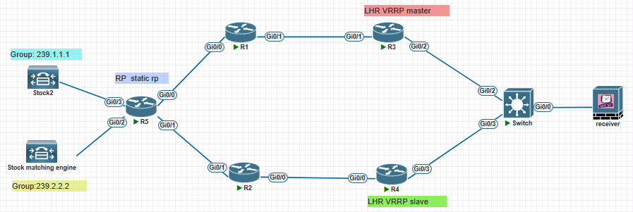
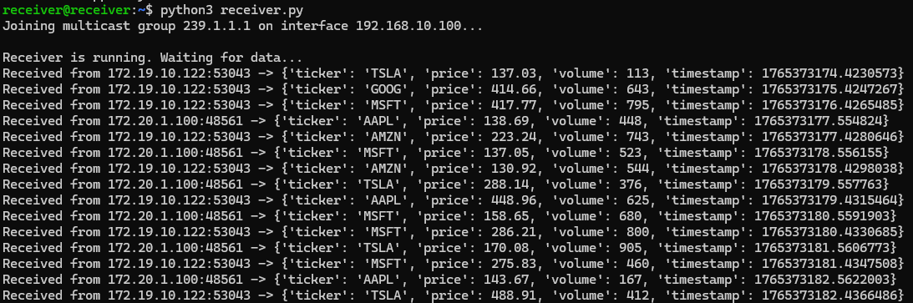
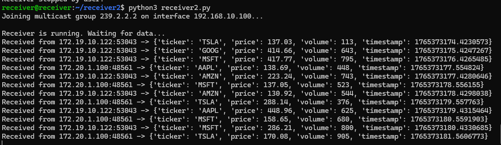

## Introduction

In the previous episode, we covered the fundamentals of multicast networks for trading systems. Now, let's move on to a slightly more complex topic—PIM Sparse Mode and Redundancy. You might wonder why I'm not addressing Dense Mode.

> PIM-DM: **we forward** multicast traffic on all interfaces until a downstream router **requests us to stop forwarding**.
>
> PIM-SM: **we don't forward** multicast traffic on any interface until a downstream router **requests us to forward it.** (Rene M.)

**In summary, PIM-DM creates unpredictable traffic bursts (flooding) that cause jitter and packet loss, which translates directly to financial loss.**

Ok, let's focus on the PIM-SM. There is a trading firm using PIM-SM as its multicast route protocol. The X trading firm has a single server joining two multicast groups using PIM-SM. Two routers act as Last-Hop Routers (LHR) and utilize VRRP for redundancy. The RP is determined using static-rp. The network topology is as follows:



The network engineer, Alex, of X wants R3 to forward 239.1.1.1 and R4 to forward 239.2.2.2. But when he finished the configuration, he found some issues. The receiving server can receive both multicast groups data.

**Group 239.1.1.1:**



**Group 239.2.2.2:**



It seems like everything is fine, right? But when Alex showed the mroute table at R3 and R4, he found something wrong.

Here is the mroute table in R3:

```
R3#show ip mroute
IP Multicast Routing Table
Flags: D - Dense, S - Sparse, B - Bidir Group, s - SSM Group, C - Connected,
       L - Local, P - Pruned, R - RP-bit set, F - Register flag,
       T - SPT-bit set, J - Join SPT, M - MSDP created entry, E - Extranet,
       X - Proxy Join Timer Running, A - Candidate for MSDP Advertisement,
       U - URD, I - Received Source Specific Host Report,
       Z - Multicast Tunnel, z - MDT-data group sender,
       Y - Joined MDT-data group, y - Sending to MDT-data group,
       G - Received BGP C-Mroute, g - Sent BGP C-Mroute,
       N - Received BGP Shared-Tree Prune, n - BGP C-Mroute suppressed,
       Q - Received BGP S-A Route, q - Sent BGP S-A Route,
       V - RD & Vector, v - Vector, p - PIM Joins on route,
       x - VxLAN group
Outgoing interface flags: H - Hardware switched, A - Assert winner, p - PIM Join
 Timers: Uptime/Expires
 Interface state: Interface, Next-Hop or VCD, State/Mode

(*, 239.1.1.1), 00:29:11/00:02:59, RP 5.5.5.5, flags: SP
  Incoming interface: GigabitEthernet0/1, RPF nbr 10.0.13.1
  Outgoing interface list: Null

(*, 239.255.255.250), 04:03:04/00:02:58, RP 5.5.5.5, flags: SP
  Incoming interface: GigabitEthernet0/1, RPF nbr 10.0.13.1
  Outgoing interface list: Null

(*, 239.2.2.2), 00:28:59/00:02:04, RP 5.5.5.5, flags: SP
  Incoming interface: GigabitEthernet0/1, RPF nbr 10.0.13.1
  Outgoing interface list: Null

(*, 224.0.1.40), 04:03:04/00:02:57, RP 5.5.5.5, flags: SJPCL
  Incoming interface: GigabitEthernet0/1, RPF nbr 10.0.13.1
  Outgoing interface list: Null
```

Here is the mroute table in R4:

```
R4#show ip mroute
IP Multicast Routing Table
...
(*, 239.1.1.1), 00:30:17/stopped, RP 5.5.5.5, flags: SJC
  Incoming interface: GigabitEthernet0/0, RPF nbr 10.0.24.1
  Outgoing interface list:
    GigabitEthernet0/1, Forward/Sparse, 00:30:17/00:02:48

(172.19.10.122, 239.1.1.1), 00:01:20/00:01:38, flags: JT
  Incoming interface: GigabitEthernet0/0, RPF nbr 10.0.24.1
  Outgoing interface list:
    GigabitEthernet0/1, Forward/Sparse, 00:01:20/00:02:48

(*, 239.2.2.2), 00:30:05/stopped, RP 5.5.5.5, flags: SJC
  Incoming interface: GigabitEthernet0/0, RPF nbr 10.0.24.1
  Outgoing interface list:
    GigabitEthernet0/1, Forward/Sparse, 00:25:39/00:02:55

(172.20.1.100, 239.2.2.2), 00:01:18/00:01:41, flags: JT
  Incoming interface: GigabitEthernet0/0, RPF nbr 10.0.24.1
  Outgoing interface list:
    GigabitEthernet0/1, Forward/Sparse, 00:01:18/00:02:55
```

He found that the LHR of the forwarding paths for both multicast streams is R4. First, R3 is the master of VRRP, so R3 should become the LHR for the multicast stream. Second, according to his plan, R3 and R4 should each serve as the LHR for a multicast stream. This is clearly inconsistent with what he expected. He is thinking about where his mistake might be.

## Question

**In this scenario, Alex made two mistakes that caused this phenomenon. Can you identify the two reasons and modify the configurations?**

## Configuration

### R3

```bash
interface Loopback0
 no shutdown
 ip address 3.3.3.3 255.255.255.255
 ip ospf 1 area 0
!
interface GigabitEthernet0/0
 no shutdown
 ip address 192.168.10.2 255.255.255.0
 ip pim sparse-mode
 ip ospf 1 area 0
 duplex auto
 speed auto
 media-type rj45
 vrrp 100 ip 192.168.10.1
 vrrp 100 priority 150
!
interface GigabitEthernet0/1
 no shutdown
 ip address 10.0.13.2 255.255.255.252
 ip pim sparse-mode
 ip ospf 1 area 0
 duplex auto
 speed auto
 media-type rj45

ip pim rp-address 5.5.5.5
```

### R4

```bash
interface Loopback0
 no shutdown
 ip address 4.4.4.4 255.255.255.255
 ip ospf 1 area 0
!
interface GigabitEthernet0/0
 no shutdown
 ip address 10.0.24.2 255.255.255.252
 ip pim sparse-mode
 ip ospf 1 area 0
 duplex auto
 speed auto
 media-type rj45
!
interface GigabitEthernet0/1
 no shutdown
 ip address 192.168.10.3 255.255.255.0
 ip pim sparse-mode
 ip ospf 1 area 0
 duplex auto
 speed auto
 media-type rj45
 vrrp 100 ip 192.168.10.1

ip pim rp-address 5.5.5.5
```

### Switch

```bash
vlan 100

ip igmp snooping

interface Ethernet1/1
  switchport
  switchport access vlan 100
  no shutdown

interface Ethernet1/2
  switchport
  switchport access vlan 100
  no shutdown

interface Ethernet1/3
  switchport
  switchport access vlan 100
  no shutdown
```

### R1

```bash
interface Loopback0
 no shutdown
 ip address 1.1.1.1 255.255.255.255
 ip ospf 1 area 0
!
interface GigabitEthernet0/0
 no shutdown
 ip address 10.0.51.2 255.255.255.252
 ip pim sparse-mode
 ip ospf 1 area 0
!
interface GigabitEthernet0/1
 no shutdown
 ip address 10.0.13.1 255.255.255.252
 ip pim sparse-mode
 ip ospf 1 area 0

ip pim rp-address 5.5.5.5
```

### R2

```bash
interface Loopback0
 no shutdown
 ip address 2.2.2.2 255.255.255.255
 ip ospf 1 area 0
!
interface GigabitEthernet0/0
 no shutdown
 ip address 10.0.24.1 255.255.255.252
 ip pim sparse-mode
 ip ospf 1 area 0
!
interface GigabitEthernet0/1
 no shutdown
 ip address 10.0.52.2 255.255.255.252
 ip pim sparse-mode
 ip ospf 1 area 0

ip pim rp-address 5.5.5.5
```

### R5

```bash
interface Loopback0
 no shutdown
 ip address 5.5.5.5 255.255.255.255
 ip ospf 1 area 0
!
interface GigabitEthernet0/0
 no shutdown
 ip address 10.0.51.1 255.255.255.252
 ip pim sparse-mode
 ip ospf 1 area 0
!
interface GigabitEthernet0/1
 no shutdown
 ip address 10.0.52.1 255.255.255.252
 ip pim sparse-mode
 ip ospf 1 area 0
!
interface GigabitEthernet0/2
 no shutdown
 ip address 172.19.10.1 255.255.255.0
 ip pim sparse-mode
 ip ospf 1 area 0
!
interface GigabitEthernet0/3
 no shutdown
 ip address 172.20.1.1 255.255.255.0
 ip pim sparse-mode
 ip ospf 1 area 0
!
router ospf 1
 passive-interface GigabitEthernet0/2
 passive-interface GigabitEthernet0/3
!

ip pim rp-address 5.5.5.5
```

## Reference

1. Rene M. [Multicast PIM Dense Mode](https://networklessons.com/multicast/multicast-pim-dense-mode)
