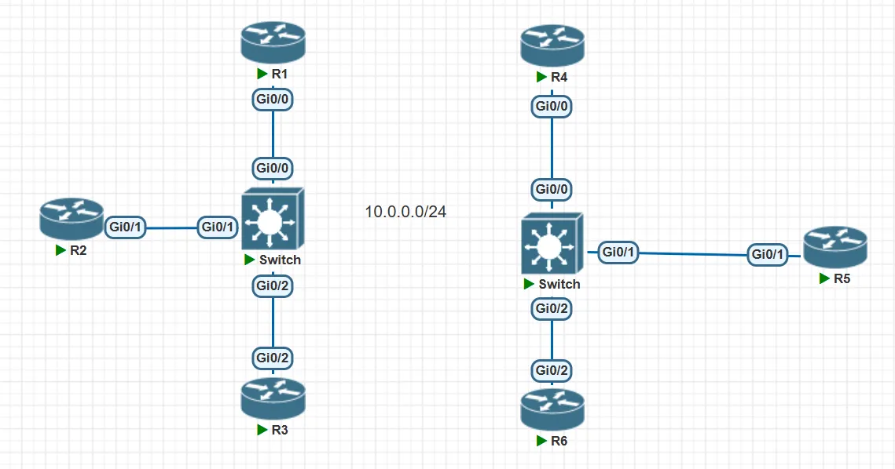
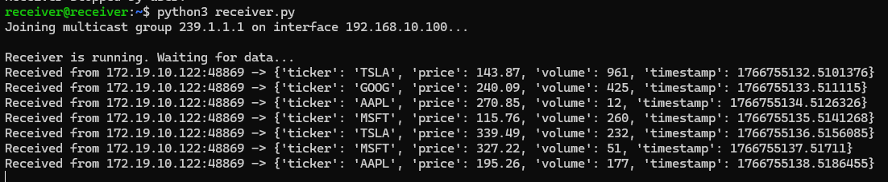
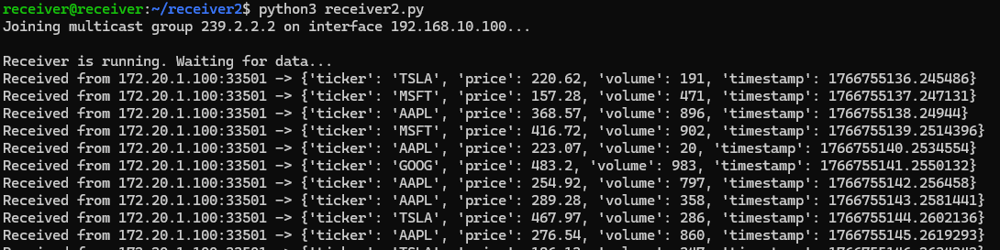

## Introduction

Howdy everybody! Christmas Day! 🎅

I've got an offer for a fintech company, so lately I've been busy with visa transfers and various onboarding procedures. 🥳

Additionally, I tested an AI workflow—agent automating alert handling on the network management platform. The specific process is below:

Prometheus monitor infra → If it has an alert, it will parse it and send an alert to the corresponding agent (like network agent or k8s agent, etc.) → The agent will analyze the alert and give the report to the review agent → Review agent analyzes the report and gives some advice and orders to the previous agent, teaching them what they do → Network agent will call some related tools (abstracting as API by netmiko or similar libs) → And then fixing the issue automatically without any human intervention required → If the Review agent thinks this issue is so important, it will ask for human intervention.

It can be found in my repo [AIautomation](https://github.com/beautiful1112/AIautomation).

Go back to our scenario, when Alex had configured, he found that the VRRP standby router was forwarding two multicast streams. He was confused. First, he thought the VRRP active router should be forwarding the multicast stream. Second, he wanted the VRRP active router to handle multicast traffic for 239.1.1.1, while the VRRP standby router should handle 239.2.2.2. The current situation clearly didn't match his expectations. And more limitations for this scenario are that we can't change or add more VLANs because of some layman's wrong decisions. Additionally, these two multicast addresses actually send the same market data. The company definitely listened to both multicast addresses at the same time to ensure their devices do not interrupt data reception.



## Question 1

When we have to think about Multicast redundancy, what protocols jump into our minds? Given that there is more than one LHR, we should think about the PIM-DR election.

> When we configure PIM on our routers, we will establish PIM neighbor adjacencies, and the PIM hello messages are also used to elect a designated router for each multi-access network. The DR is the router that will **forward the PIM join** message from the receiver to the RP (rendezvous point).
>
> By default, the **highest IP address** determines who will become the DR.

So, regarding the first question, it's clearly because R4 has a higher IP address, so it was selected as the PIM-DR. We can change the DR priority to make R3 become the PIM-DR.

```bash
R3

int g0/0
 ip pim dr-priority 100  # default value is 1
```

Let's check the mrouting table.

```
R3#show ip mroute
...
(*, 239.1.1.1), 00:05:02/stopped, RP 5.5.5.5, flags: SJC
  Incoming interface: GigabitEthernet0/1, RPF nbr 10.0.13.1
  Outgoing interface list:
    GigabitEthernet0/0, Forward/Sparse, 00:00:24/00:02:50

(172.19.10.122, 239.1.1.1), 00:00:14/00:02:45, flags: JT
  Incoming interface: GigabitEthernet0/1, RPF nbr 10.0.13.1
  Outgoing interface list:
    GigabitEthernet0/0, Forward/Sparse, 00:00:14/00:02:50
...
```

```
R4#show ip mroute
...
(*, 239.1.1.1), 00:05:12/00:02:39, RP 5.5.5.5, flags: SP
  Incoming interface: GigabitEthernet0/0, RPF nbr 10.0.24.1
  Outgoing interface list: Null
...
```



OK, we made it! Let's move to the next requirement—redundancy.

## Question 2

Since Alex wants R3 forwarding group 239.1.1.1 and R4 forwarding group 239.2.2.2, we have to use some method to let both of them sending pim join messages to the RP. So we have to introduce _ip pim neighbor-filter._ Since two LHRs in the same LAN will trigger the DR election. Why would we use an ACL to filter PIM hello messages to prevent the formation of a PIM neighborship?

```bash
R3
access-list 10 permit 3.3.3.3

int g0/0
 ip pim neighbor-filter 10
```

```bash
R4
access-list 10 permit 4.4.4.4

int g0/1
 ip pim neighbor-filter 10
```

OK, let's check the mrouting table.

```
R3#show ip mroute
...
(*, 239.1.1.1), 00:34:09/stopped, RP 5.5.5.5, flags: SJC
  Incoming interface: GigabitEthernet0/1, RPF nbr 10.0.13.1
  Outgoing interface list:
    GigabitEthernet0/0, Forward/Sparse, 00:00:10/00:02:55
...
```

```
R4#show ip mroute
...
(*, 239.2.2.2), 00:37:45/stopped, RP 5.5.5.5, flags: SJC
  Incoming interface: GigabitEthernet0/0, RPF nbr 10.0.24.1
  Outgoing interface list:
    GigabitEthernet0/1, Forward/Sparse, 00:37:45/00:02:28
...
```

It seems like working fine. But I don't know if you notice that R3 and R4 are both forwarding the two streams. It violates efficiency. So let me introduce the other mechanism—multicast boundary.

This mechanism uses ACL to filter the specific group streams or RP groups. Let me show it.

```bash
R3

ip access-list standard MULTICAST_FILTER
 permit 239.1.1.1

int g0/0
 ip multicast boundary MULTICAST_FILTER out  # notice the direction
```

```bash
R4
ip access-list standard MULTICAST_FILTER
 permit 239.2.2.2

int g0/1
 ip multicast boundary MULTICAST_FILTER out  # notice the direction
```

Let's check the mrouting table again.

```
R3#show ip mroute
...
(*, 239.1.1.1), 00:42:57/stopped, RP 5.5.5.5, flags: SJC
  Incoming interface: GigabitEthernet0/1, RPF nbr 10.0.13.1
  Outgoing interface list:
    GigabitEthernet0/0, Forward/Sparse, 00:08:58/00:02:05

(*, 239.2.2.2), 00:09:01/stopped, RP 5.5.5.5, flags: SP
  Incoming interface: GigabitEthernet0/1, RPF nbr 10.0.13.1
  Outgoing interface list: Null
...
```

```
R4#show ip mroute
...
(*, 239.1.1.1), 00:08:49/stopped, RP 5.5.5.5, flags: SP
  Incoming interface: GigabitEthernet0/0, RPF nbr 10.0.24.1
  Outgoing interface list: Null

(*, 239.2.2.2), 00:45:59/stopped, RP 5.5.5.5, flags: SJC
  Incoming interface: GigabitEthernet0/0, RPF nbr 10.0.24.1
  Outgoing interface list:
    GigabitEthernet0/1, Forward/Sparse, 00:45:59/00:02:09
...
```

It works! So I think Alex will have a good sleep and keep safe for his position. 😜

Let's check the receiver:



As right as rain! The boss will have a good sleep as well.

## Conclusion

No matter what network infrastructure, all we need to consider is the redundancy. Multicast is no exception. On the last hop network, we need to think about PIM DR election, which we can use the ACL to prevent. But we should notice that when we prevent this mechanism, which means we break some efficient way to forward streams. So we have to use the multicast boundary to optimize it.

## Quiz

Why don't I enable _ip pim non-dr-join_ to let R4 send the PIM join message to RP?
