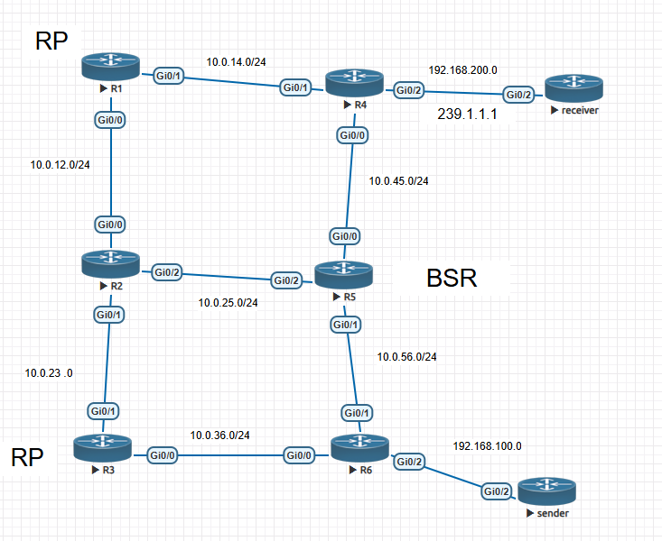
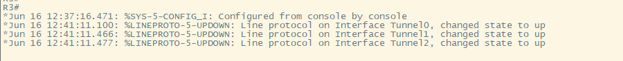
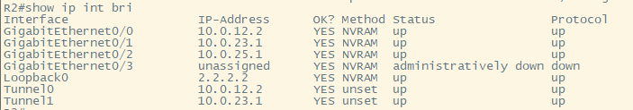
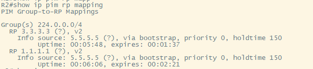
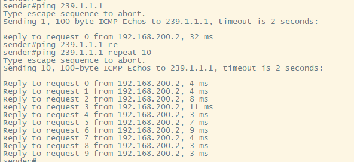

## Scenario

### Topology



### Summary

When we enable RP candidates on R1 and R3, and enable BSR candidate on R5, tunnel interfaces are created for multicast message transmission. Under the BSR mechanism, any router with PIM sparse mode enabled that receives a BSR announcement will forward the BSR message to other PIM sparse mode-enabled interfaces.

### Configuration on R1 (others are similar)

```bash
interface gig0/1
    ip add 10.0.12.1 255.255.255.0
    ip pim sparse-mode   # enable pim spare-mode
    no shutdown
interface gig0/0
    ip add 10.0.14.1 255.255.255.0
    ip pim sparse-mode
    no shutdown
interface loopback0
    ip add 1.1.1.1 255.255.255.255
    ip pim sparse-mode
    no shutdown
router ospf 1
    network 0.0.0.0 255.255.255.255 area 0 # enable ospf on all interfaces like a shotgun
ip multicast-routing  # Enable Multicast, this is mandatoray
```

### Enable RP on R1 & R3

```bash
ip pim rp-candidate loopback 0
```

### Enable BSR on R5

```bash
ip pim bsr-candidate loopback 0
```

### You will see sort of funny things as below

When we enable BSR on R5, each router creates tunnel interfaces that are associated with physical interfaces.



The tunnel interfaces share the same IP addresses as their corresponding physical interfaces.



R2, R4, and R6 each have two RPs in their RP group. Each router will automatically select one RP to use.



When we begin to send multicast traffic:

```bash
receiver(config-if)#ip igmp join-group 239.1.1.1
```

It works fine.



## Conclusion

We can find that the BSR sends messages on a **hop-by-hop basis**. So we can see that even though BSR is two hops away from RP, it can still allow all routers to receive the relevant information about RP.
