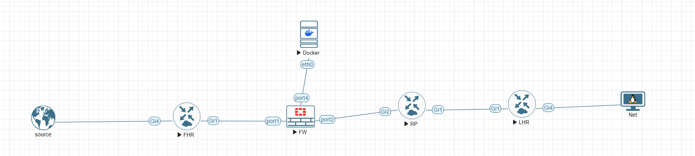
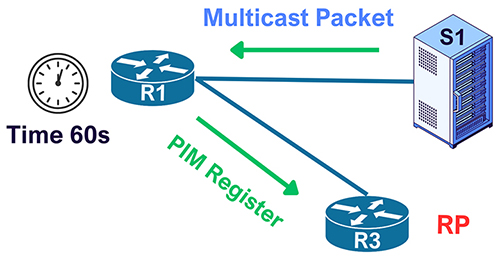
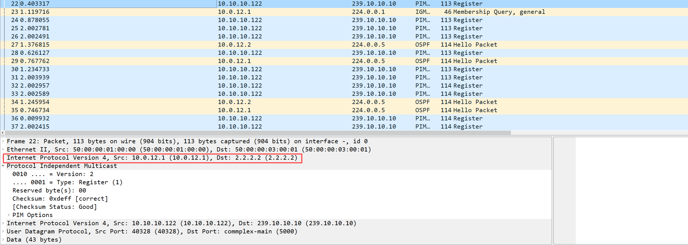
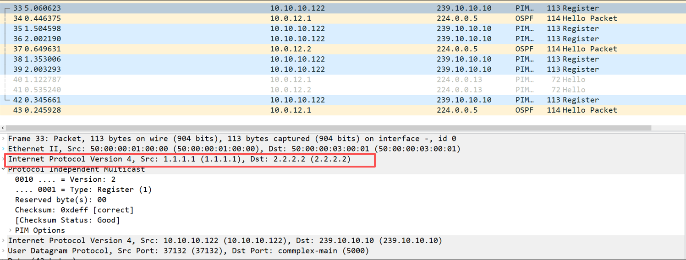
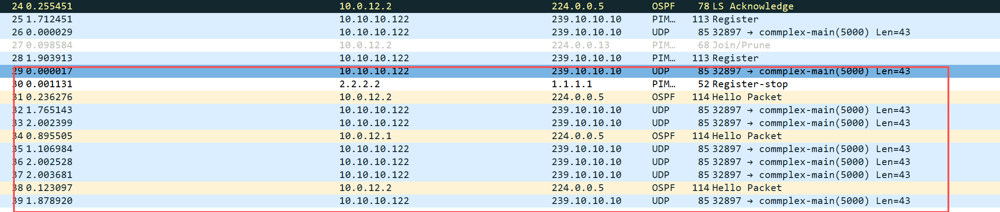

I raised a question in my previous blog. Let's recall it quickly. Alex is working for a quant trading firm as a network engineer. One day he was assigned a troubleshooting ticket: his colleague John said that they built a trading simulation network, but the subscriber could not receive any market data from the source. Here is the topology. For the configuration, see [Why can't they establish a multicast forwarding path?](/post/why-cant-they-establish-a-multicast-forwarding-path).



Alex told his colleague that the root cause is the PIM Register.

## What is the PIM Register?

> A PIM Register message is a unicast packet sent by a Designated Router (DR) to a Rendezvous Point (RP) in PIM Sparse Mode, to register an active multicast source.

When the source sends a multicast stream to the FHR, the FHR encapsulates those multicast packets as unicast and forwards them to the RP. The question in this lab is: what address does that Register packet use as its source?



## The Register source is the outgoing interface

Alex captured packets on Gi1 of the FHR. Wireshark shows the following.



If we do not configure a register source, PIM uses the IP address of the outgoing interface. Here that is `10.0.12.1` on Gi1, and the destination is the RP, `2.2.2.2`. The inner packet is still the original stream, `10.10.10.122` to `239.10.10.10`.

The firewall only permitted the loopback addresses of the three routers. A Register sourced from `10.0.12.1` does not match that policy, so the RP never received it.

Alex logged in to the FHR and configured:

```
FHR(config)#ip pim register-source loopback 0
```

The trading team said they could receive the market data. Alex captured Gi1 again.



The source had changed to `1.1.1.1`, the FHR loopback. The RP could receive the Register, and the subscriber could receive market data. Then Alex noticed something else. The FHR was still only forwarding Register packets, and those packets were carrying the market data. Where were the raw multicast packets?

## Register continues until Register-Stop

That is how PIM Sparse Mode works. The FHR keeps encapsulating the multicast stream in Register messages and sending them to the RP until it receives a Register-Stop. The RP sends Register-Stop in two cases: there are no receivers, or the RP has started receiving the raw stream on the shortest-path tree.

In this lab the RP never built that SPT. Alex guessed that the RP did not know how to reach the source, and the routing table confirmed it. There is no route to `10.10.10.122`.

```
RP#show ip route
...
      1.0.0.0/32 is subnetted, 1 subnets
O        1.1.1.1 [110/2] via 10.0.12.1, 00:27:46, GigabitEthernet2
      2.0.0.0/32 is subnetted, 1 subnets
C        2.2.2.2 is directly connected, Loopback0
      3.0.0.0/32 is subnetted, 1 subnets
O        3.3.3.3 [110/2] via 10.0.23.2, 00:40:21, GigabitEthernet1
      10.0.0.0/8 is variably subnetted, 4 subnets, 2 masks
C        10.0.12.0/30 is directly connected, GigabitEthernet2
L        10.0.12.2/32 is directly connected, GigabitEthernet2
C        10.0.23.0/30 is directly connected, GigabitEthernet1
L        10.0.23.1/32 is directly connected, GigabitEthernet1
```

The debug on the RP shows the same failure. Registers arrive from `1.1.1.1`, and every attempt to join toward the source is ignored because the RPF neighbor is `0.0.0.0`.

```
*Oct  2 14:07:34.471: PIM(0): Adding register decap tunnel (Tunnel1) as accepting interface of (10.10.10.122, 239.10.10.10).
*Oct  2 14:07:34.471: PIM(0):  Join to 0.0.0.0 on  for (10.10.10.122, 239.10.10.10), Ignored.
*Oct  2 14:07:36.420: PIM(0): Received v2 Register on GigabitEthernet2 from 1.1.1.1
*Oct  2 14:07:36.420:      for 10.10.10.122, group 239.10.10.10
*Oct  2 14:07:36.471: PIM(0):  Join to 0.0.0.0 on  for (10.10.10.122, 239.10.10.10), Ignored.
*Oct  2 14:07:38.422: PIM(0): Received v2 Register on GigabitEthernet2 from 1.1.1.1
*Oct  2 14:07:38.422:      for 10.10.10.122, group 239.10.10.10
*Oct  2 14:07:38.472: PIM(0):  Join to 0.0.0.0 on  for (10.10.10.122, 239.10.10.10), Ignored.
```

## Put the source into OSPF

Alex advertised the source interface into OSPF:

```
FHR(config)#int g4
FHR(config-if)#ip ospf 1 area 0
```

After that, Wireshark on the FHR showed the raw market data, UDP to `239.10.10.10`, and the RP answered with Register-Stop from `2.2.2.2` to `1.1.1.1`.



The debug on the RP changed with it. The RP inserted an (S,G) join toward `10.0.12.1`, then removed the register decap tunnel and installed Gi2 as the accepting interface.

```
*Oct  3 09:31:32.607: PIM(0): Received v2 Register on GigabitEthernet2 from 1.1.1.1
*Oct  3 09:31:32.607:      for 10.10.10.122, group 239.10.10.10
*Oct  3 09:31:32.608: PIM(0): Adding register decap tunnel (Tunnel1) as accepting interface of (10.10.10.122, 239.10.10.10).
*Oct  3 09:31:32.609: PIM(0): Insert (10.10.10.122,239.10.10.10) join in nbr 10.0.12.1's queue
*Oct  3 09:31:32.609: PIM(0): Building Join/Prune packet for nbr 10.0.12.1
*Oct  3 09:31:32.610: PIM(0):  Adding v2 (10.10.10.122/32, 239.10.10.10), S-bit Join
*Oct  3 09:31:32.610: PIM(0): Send v2 join/prune to 10.0.12.1 (GigabitEthernet2)
*Oct  3 09:31:32.622: PIM(0): Received v2 Join/Prune on GigabitEthernet1 from 10.0.23.2, to us
*Oct  3 09:31:32.623: PIM(0): Join-list: (10.10.10.122/32, 239.10.10.10), S-bit set
*Oct  3 09:31:32.623: PIM(0): Update GigabitEthernet1/10.0.23.2 to (10.10.10.122, 239.10.10.10), Forward state, by PIM SG Join
*Oct  3 09:31:34.583: PIM(0): Received v2 Register on GigabitEthernet2 from 1.1.1.1
*Oct  3 09:31:34.583:      for 10.10.10.122, group 239.10.10.10
*Oct  3 09:31:34.588: PIM(0): Removing register decap tunnel (Tunnel1) as accepting interface of (10.10.10.122, 239.10.10.10).
*Oct  3 09:31:34.588: PIM(0): Installing GigabitEthernet2 as accepting interface for (10.10.10.122, 239.10.10.10).
```

The mroute on the RP now has the source tree. `(10.10.10.122, 239.10.10.10)` comes in Gi2 from `10.0.12.1` and goes out Gi1 toward the LHR. The T flag means the SPT bit is set.

```
RP#show ip mroute
...
(*, 239.10.10.10), 00:10:57/00:03:19, RP 2.2.2.2, flags: S
  Incoming interface: Null, RPF nbr 0.0.0.0
  Outgoing interface list:
    GigabitEthernet1, Forward/Sparse, 00:02:44/00:03:19

(10.10.10.122, 239.10.10.10), 00:07:09/00:02:36, flags: T
  Incoming interface: GigabitEthernet2, RPF nbr 10.0.12.1
  Outgoing interface list:
    GigabitEthernet1, Forward/Sparse, 00:02:44/00:03:19
...
```

After confirming that the SPT was up, Alex closed the ticket and told John and the trading team that the stream was repaired.

Finally, he wrote to the security team. He had found a serious hole in a firewall policy that could, under certain circumstances, black-hole traffic from the FHR all the way to the RP and the LHR.

Do you know what it is?
